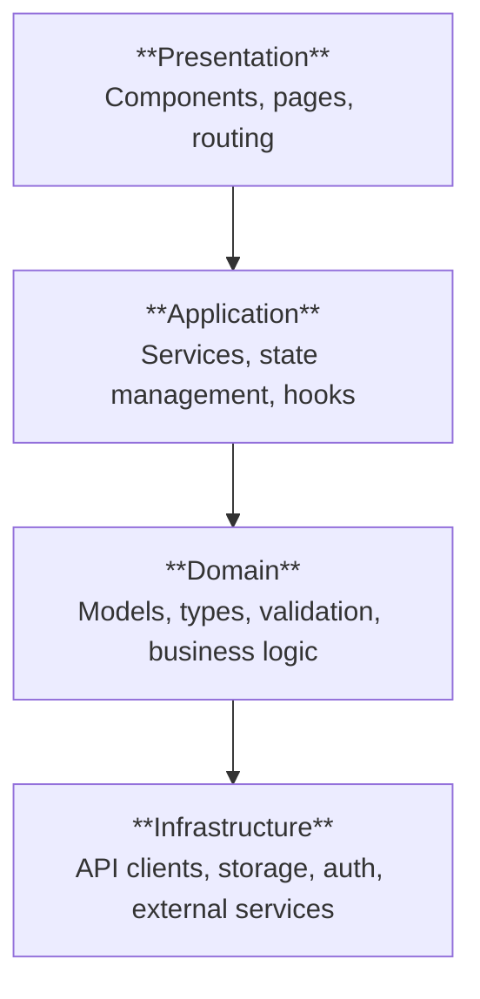

# {PROJECT-NAME} — Architecture

## Technical Overview

{2-4 sentences. High-level approach. Technology choices and why.}

## System Layers



## Module Map

| Module | Layer | Path | Responsibility |
|--------|-------|------|---------------|
| `{module}` | {Layer} | `{path}` | {Responsibility} |

## Contracts & Interfaces

### {Module Name} Interfaces

```typescript
// {path/to/types.ts}
interface {InterfaceName} {
  {field}: {type};
}
```

## API Endpoints

| Method | Path | Request | Response | Auth |
|--------|------|---------|----------|------|
| {METHOD} | `{path}` | `{Type}` | `{Type}` | {None/Required} |

## Dependencies

### External Dependencies

| Package | Version | Purpose |
|---------|---------|---------|
| `{package}` | `{version}` | {Purpose} |

### Internal Dependencies (module → module)

```
{module-a} → {module-b} → {module-c}
```

## File Structure

```
src/
├── {path}/
│   ├── {file}              # {Description}
│   └── {file}              # {Description}
```

## Cross-Cutting Concerns

| Concern | Strategy |
|---------|----------|
| Error handling | {Approach} |
| Logging | {Approach} |
| Authentication | {Approach} |
| State management | {Approach} |

## Phasing Recommendations

{High-level suggestion for how this should be phased. The Tactical Planner will make final phasing decisions.}

1. **Phase 1**: {Foundation — domain types, API client}
2. **Phase 2**: {Core — service layer, state management}
3. **Phase 3**: {UI — components, routing, styling}
4. **Phase 4**: {Polish — error handling, edge cases, tests}
