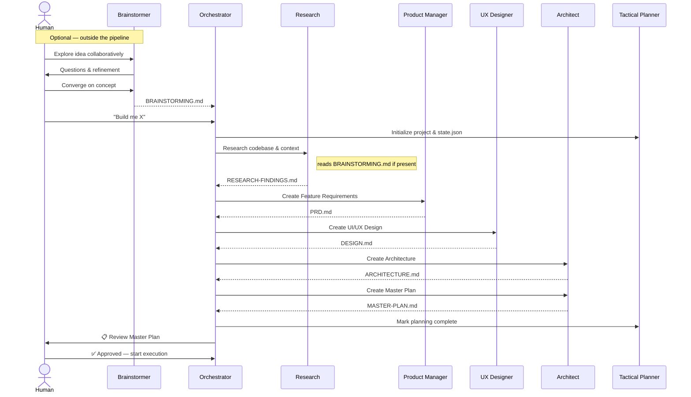
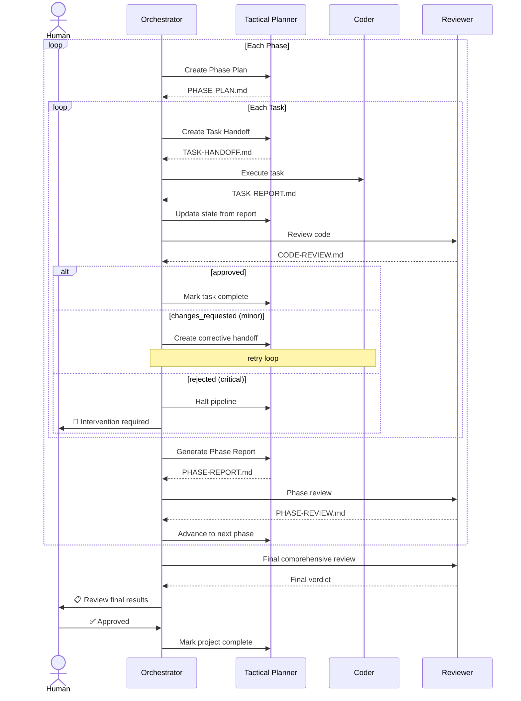

# Orchestration System

A **document-driven agent orchestration system** that takes software projects from idea through planning, execution, and review — built entirely on native AI coding assistant primitives. No custom framework, no external runtime. The orchestration system *is* the configuration files.

## How It Works

Tell the Orchestrator your project idea, and it coordinates 9 specialized agents through a structured pipeline.

#### Planning Pipeline



#### Execution Pipeline



Agents communicate exclusively through **structured markdown documents** — no shared state, no memory, no message passing. Each agent reads specific documents, does its job, and writes its output document. The Orchestrator reads project state and spawns the right agent at the right time. 

After each task or phase completion structured reports are checked against the planning documents — architectural violations, requirement gaps, and quality regressions.  Minor issues trigger auto-retries with corrective tasks; critical issues halt the pipeline for human intervention.

## Features

### 9 Specialized Agents

| Agent | Role | Write Access |
|-------|------|--------------|
| **Brainstormer** | Collaborative ideation with the human — standalone, outside the pipeline | `BRAINSTORMING.md` only |
| **Orchestrator** | Coordinates the pipeline — spawns agents, reads state, asks human questions | None (read-only) |
| **Research** | Explores codebase, docs, and external sources for context | Project docs |
| **Product Manager** | Creates PRDs from research findings | Project docs |
| **UX Designer** | Reads PRD to create design documents | Project docs |
| **Architect** | Reads Research, PRD, and Design to define system architecture, contracts, interfaces; synthesizes all planning docs into Master Plans | Project docs |
| **Tactical Planner** | Breaks phases into tasks, reads task reports and reviews to assess progress and catch issues, manages state — sole writer of `state.json` and `STATUS.md` | Project docs + state |
| **Coder** | Reads self-contained Task Handoffs to execute tasks and write code, tests, and task completion reports | Source code + tests + reports |
| **Reviewer** | Reviews code and phases against planning documents | Reports only |

Key design constraints:
- The **Brainstormer is standalone** — it works directly with the human outside the pipeline, producing an optional input document
- The **Orchestrator is strictly read-only** — it never writes files
- The **Coder reads only its Task Handoff** — everything it needs is self-contained in one document
- **Only the Tactical Planner writes state** — no other agent touches `state.json` or `STATUS.md`

### 16 Skills

Skills are reusable capabilities bundled with templates and instructions. The skills reinforce adherance to the process. Each agent is explicitly assigned the skills it needs to perform its role in the loop.  By composing agents with skills the system can be easily extended with new agents, capabilities or adapted to new workflows.

| Skill | Purpose |
|-------|---------|
| `brainstorm` | Collaborative ideation — explore, refine, and converge on project ideas |
| `research-codebase` | Explore and analyze codebases, docs, and external sources |
| `create-prd` | Generate Product Requirements Documents from research findings |
| `create-design` | Create UX Design documents from PRDs |
| `create-architecture` | Define system architecture from PRD + Design |
| `create-master-plan` | Synthesize all planning docs into a Master Plan |
| `create-phase-plan` | Break phases into concrete tasks with dependencies |
| `create-task-handoff` | Create self-contained task documents for the Coder |
| `generate-task-report` | Document task completion, files changed, test results |
| `generate-phase-report` | Summarize phase outcomes and exit criteria |
| `run-tests` | Execute test suites and report results |
| `review-code` | Review code against plan, architecture, and design |
| `review-phase` | Cross-task integration review for entire phases |
| `create-agent` | Meta-skill for scaffolding new agents |
| `create-skill` | Meta-skill for scaffolding new skills |
| `validate-orchestration` | Validate all orchestration files for correctness |

### Document-Driven Architecture

Every agent interaction produces a structured markdown document. Documents are the API — no runtime coupling between agents.

**Ideation output (optional):**
- `BRAINSTORMING.md` — Validated ideas, scope boundaries, problem statements from human collaboration

**Planning outputs:**
- `RESEARCH-FINDINGS.md` — Codebase analysis, patterns, constraints
- `PRD.md` — Problem statement, user stories, requirements (numbered FR-/NFR-)
- `DESIGN.md` — User flows, component layouts, breakpoints, states, accessibility
- `ARCHITECTURE.md` — System layers, module map, contracts, API endpoints, Database Schemas
- `MASTER-PLAN.md` — Executive summary, phase outlines, risk register

**Execution outputs:**
- `PHASE-PLAN.md` — Task breakdown, dependency graph, execution order
- `TASK-HANDOFF.md` — Self-contained coding instructions with inlined contracts and requirements
- `TASK-REPORT.md` — Changed files, test results, emerging issues, plan deviations, discoveries
- `PHASE-REPORT.md` — Aggregated results, exit criteria assessment
- `CODE-REVIEW.md` / `PHASE-REVIEW.md` — Verdicts against PRD, architecture, and design; checklists; flagged violations

### Pipeline State Management

Project state is tracked in `state.json` with strict invariants:
- Tasks progress linearly: `not_started` → `in_progress` → `complete` | `failed`
- Only one task can be `in_progress` at a time across the entire project (parallelism coming soon)
- State transitions are informed by report analysis — the Tactical Planner reads task reports and reviews to determine whether work meets exit criteria or needs correction
- Human approval is required before transitioning from planning to execution
- Configurable Retry counts and limits prevent infinite loops and enforce progress

`STATUS.md` provides a human-readable summary updated after every significant event.

### Configurable Pipeline

All system behavior is controlled by a single `orchestration.yml` file:

- **Project storage** — configurable base path and naming conventions
- **Pipeline limits** — max phases, tasks per phase, # of allowed retries per task
- **Error handling** — critical errors halt the pipeline; minor errors auto-retry
- **Git strategy** — single branch, branch-per-phase, or branch-per-task (worktrees coming soon)
- **Human gates** — configurable approval points (after planning, per-phase, per-task, or fully autonomous)

### Built-in Validation

A zero-dependency Node.js CLI tool validates the entire orchestration ecosystem — file structure, frontmatter correctness, cross-references between agents and skills, configuration schema, and more. Returns CI-friendly exit codes with category-grouped output.

See [.github/skills/validate-orchestration/README.md](.github/skills/validate-orchestration/README.md) for usage, CLI options, and complete validation details.

### Human Gates

The system enforces human checkpoints at critical decision points:

- **After planning** — review the Master Plan before any code is written (always enforced)
- **During execution** — configurable: ask at start, gate per-phase, gate per-task, or autonomous
- **After final review** — approve completion before the project is marked done (always enforced)

### Error Handling

Errors are classified by severity with automatic response:

| Severity | Examples | Response |
|----------|----------|----------|
| **Critical** | Build failure, security vulnerability, architectural violation, data loss risk | Pipeline halts, human intervention required |
| **Minor** | Test failure, lint error, review suggestion, missing coverage, style violation | Auto-retry via corrective task |

### Scoped Instructions

Instruction files use `applyTo` patterns to load context-specific rules only when relevant:
- `project-docs.instructions.md` — naming conventions and file ownership for project documents
- `state-management.instructions.md` — invariants for `state.json` and `STATUS.md`

## Getting Started

### Prerequisites

- Node.js v14+ (for the validation tool only — no npm dependencies)
- GitHub Copilot (VS Code) — the system is built on Copilot's native primitives (other agents coming soon)

### Quick Start

1. **Clone the repo** and open in VS Code with GitHub Copilot enabled
2. **Copy the .github/ directory** into the root of your project
3. **Configure** the system using the `/configure-system` prompt
4. **Brainstorm an idea with `@Brainstormer`** or jump straight to `@Orchestrator` with your project idea
5. **Start a project** — Use `@Orchestrator` with your project idea
6. **Continue a project** — Use `@Orchestrator` and ask to continue
7. **Check status** — Use `@Orchestrator` for project status
8. **Validate** — Run the validator via `node .github/skills/validate-orchestration/scripts/validate-orchestration.js` or `/validate-orchestration` (see [validator README](.github/skills/validate-orchestration/README.md) for options)

### Project Structure

```
.github/
├── agents/                    # 9 agent definitions (.agent.md)
├── skills/                    # 16 skills
├── instructions/              # Scoped instruction files
├── prompts/                   # Prompt files for utility tasks
├── orchestration.yml          # System configuration
├── copilot-instructions.md    # Workspace-level instructions
└── projects/                  # Project artifacts (per-project subfolders) -- path configurable via orchestration.yml
    └── {PROJECT-NAME}/
        ├── BRAINSTORMING.md   # Optional ideation output
        ├── state.json         # Pipeline state
        ├── STATUS.md          # Human-readable progress
        ├── phases/            # Phase plans
        ├── tasks/             # Task handoffs
        └── reports/           # Task, phase, and review reports
```

## Platform Support

### Currently Supported

**GitHub Copilot** (VS Code) — The system is built on Copilot's native primitives:
- Custom agents (`.agent.md`) with tool and subagent declarations
- Agent skills (`SKILL.md`) with auto-discovery via description-based matching
- Prompt files (`.prompt.md`) for utility workflows
- Instruction files (`.instructions.md`) with `applyTo` scoping
- Agent mode for autonomous multi-step execution

### Coming Soon

Support for additional AI coding assistants and platforms is planned. The document-driven architecture is inherently portable — agents communicate through markdown files and YAML configuration, not through platform-specific APIs. Adapting the system to new platforms primarily involves translating agent/skill/instruction definitions to the target format.

## Design Principles

1. **Documents as interfaces** — Agents never share memory or state. Every interaction is mediated by a structured markdown document.
2. **Sole writer policy** — Every document type has exactly one agent that may write it. No conflicts, no coordination overhead.
3. **Self-contained handoffs** — Task handoffs inline all contracts, interfaces, and design tokens. The Coder never needs to read external planning documents.
4. **Strict access control** — Each agent declares its allowed tools. The Orchestrator has zero write access. The Coder can't touch state files.
5. **Human in the loop** — Critical gates are enforced, not optional. Humans approve plans before execution and results before completion.
6. **Continuous verification** — Every task produces a report, every report is checked against the plan. The Tactical Planner uses Coder reports and Reviewer assessments to ground the pipeline in reality — plans don't drift unchecked.
7. **Zero dependencies** — The validation tool runs on Node.js built-ins only. The orchestration system itself requires nothing beyond the AI platform.

## License

See [LICENSE](LICENSE) for details.
