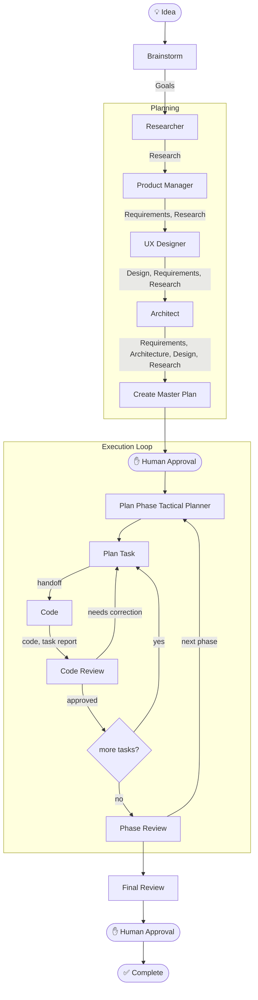
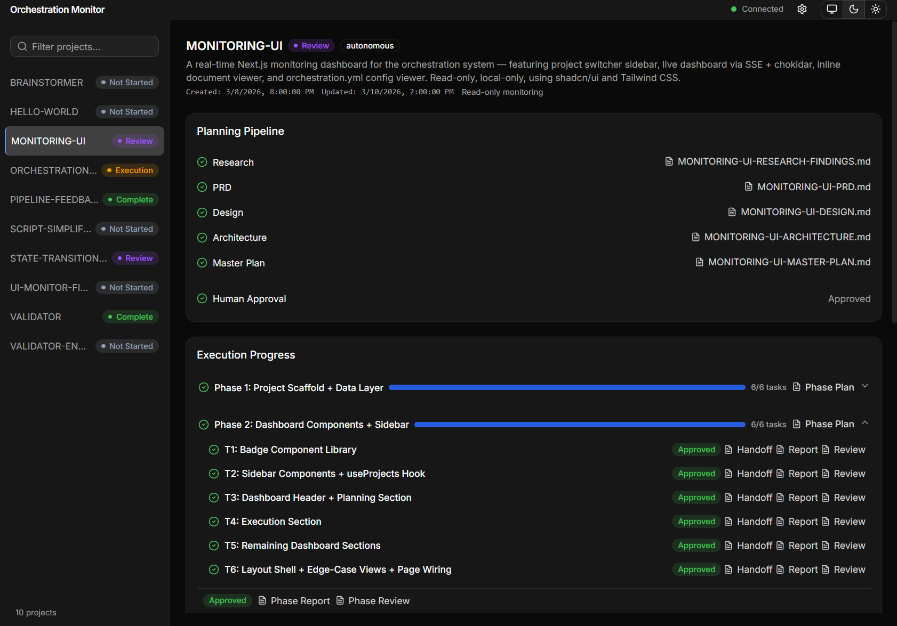

# Rad Orchestration System

A **document-driven agent orchestration system** that takes software projects from idea through planning, execution, and review — built on native AI coding assistant primitives and a small set of simple Node.js scripts.

Agents communicate through structured markdown documents. Routing, triage, and state validation are handled by a single pipeline script (`pipeline.js`). No external services, no Docker, no npm install (unless you use the Dashboard UI).

## What It Does

Tell the Orchestrator your project idea, and it coordinates **9 specialized agents** through a structured pipeline — research, requirements, design, architecture, planning, coding, and review — producing working software with full traceability from idea to implementation.  It's automated spec-driven development!

## Monitoring Dashboard

The system includes a real-time monitoring dashboard — a Next.js web application
that visualizes project state, pipeline progress, documents, and configuration.

    

Track active projects, drill into phase and task execution, read rendered planning
documents, and view configuration — all updated in real time by reading the state.json 
file in each project.  The project displayed in the screenshot was the project used to 
build the UI in 1-shot.

[Learn more about the dashboard →](docs/dashboard.md)

## Key Features

### Specialized Agents

Nine agents with strict separation of concerns. Each agent has a defined role, scoped tool access, and explicit write permissions. The Orchestrator coordinates but never writes. The Coder reads only its task handoff.

[Learn more about agents →](docs/agents.md)

### Document-Driven Architecture

Documents are the inter-agent API. Every agent reads specific input documents, does its job, and writes its output document. There is no shared memory, no message passing, no runtime coupling between agents. Every interaction produces a traceable artifact.

CLI scripts, essentially a state machine, handles the mechanical decisions *around* that document exchange — routing, triage, and state validation — but agents themselves still communicate exclusively through structured markdown. The document-driven model is what makes the system portable and auditable.

[Learn more about the pipeline →](docs/pipeline.md)

### Human Gates

Configurable critical human checkpoints are reliably enforced.  Humans approve the Master Plan before any code is written and approve final results before completion. Execution gates are configurable: per-phase, per-task, or fully autonomous. 

### Deterministic Routing & Triage

Pipeline routing, triage, and state validation are handled by a unified pipeline script (`pipeline.js`) — not LLM interpretation of prose. One event in, one deterministic action out. The script encodes ~18 external actions as a pure event-action lookup, internalizes triage decisions, and validates state invariants before every write. Same input always produces the same output.

[Learn more about the scripts →](docs/scripts.md)

### Composable Skills

Seventeen reusable skills bundle domain knowledge, templates, and instructions. Agents are composed with the skills they need — the system can be extended with new agents, capabilities, or adapted to new workflows by remixing skills.

[Learn more about skills →](docs/skills.md)

### Configurable Pipeline

A single `orchestration.yml` controls everything: project storage, pipeline limits, error severity classification, git strategy, and human gate behavior. Sensible defaults out of the box, fully customizable.

[Learn more about configuration →](docs/configuration.md)

### Continuous Verification

Every task produces a report. Every report is reviewed against the plan.  Code reviewers never fully trust the coder reports. :)  Minor issues trigger automatic corrective tasks. Critical issues halt the pipeline for human intervention. Plans don't drift unchecked. Pipeline failures are logged to a structured, append-only error log (`ERROR-LOG.md`) in each project folder.

### Built-in Validation

A zero-dependency Node.js CLI validates the entire orchestration ecosystem — agents, skills, instructions, configuration, cross-references, and file structure. CI-friendly with structured exit codes.

[Learn more about validation →](docs/validation.md)

## Getting Started

### Prerequisites

- **Node.js v18+** — for CLI scripts and validation (no npm install needed)
- **GitHub Copilot** in VS Code with agent mode enabled

### Quick Start

1. Clone the repo and open in VS Code with GitHub Copilot
2. Copy the `.github/` directory into the root of your target project
3. Run `/configure-system` to set up `orchestration.yml`
4. *(Optional)* Use `@Brainstormer` to explore and refine your ideas into goals
5. Use `@Orchestrator` with your project goals to start the pipeline
6. Use `@Orchestrator` to continue — it reads `state.json` and picks up where it left off

[Full getting started guide →](docs/getting-started.md)

> **Migrating an existing project?** Run `node .github/orchestration/scripts/migrate-to-v4.js` to upgrade `state.json` files from earlier schema versions. The script creates `.backup` copies before writing.

## Documentation

| Page | Description |
|------|-------------|
| [Getting Started](docs/getting-started.md) | Installation, first project walkthrough, common commands |
| [Agents](docs/agents.md) | All 9 agents — roles, access control, design constraints |
| [Pipeline](docs/pipeline.md) | Planning and execution flow, human gates, error handling |
| [Skills](docs/skills.md) | All 17 skills and how they compose with agents |
| [Configuration](docs/configuration.md) | `orchestration.yml` reference — all options explained |
| [Project Structure](docs/project-structure.md) | File layout, naming conventions, document types, state management |
| [Pipeline Script](docs/scripts.md) | Unified event-driven CLI — routing, triage, state mutations, validation |
| [Validation](docs/validation.md) | The `validate-orchestration` CLI tool |
| [Monitoring Dashboard](docs/dashboard.md) | Dashboard startup, features, data sources, real-time updates |

## Design Principles

1. **Documents as interfaces** — Agents never share memory. Every interaction is mediated by a structured markdown document.
2. **Sole writer policy** — Every document type has exactly one agent that may write it.
3. **Self-contained handoffs** — The Coder never reads external planning documents. Everything is inlined.
4. **Deterministic where possible** — Routing, triage, and validation are pure functions. LLMs handle judgment work.
5. **Human in the loop** — Critical gates are enforced. Humans approve plans and results.
6. **Continuous verification** — Every task is reported and reviewed against the plan.
7. **Zero dependencies** — Node.js built-ins only. No npm install.

## Platform Support

**Currently supported:** GitHub Copilot (VS Code) — custom agents, skills, prompt files, instruction files, and agent mode.

The document-driven architecture is inherently portable. Agents communicate through markdown and YAML, not platform APIs. Adapting to other AI assistants primarily involves translating agent definitions to the target format.

## License

See [LICENSE](LICENSE) for details.
