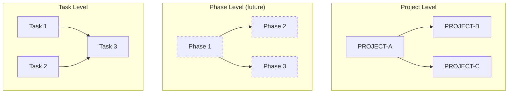
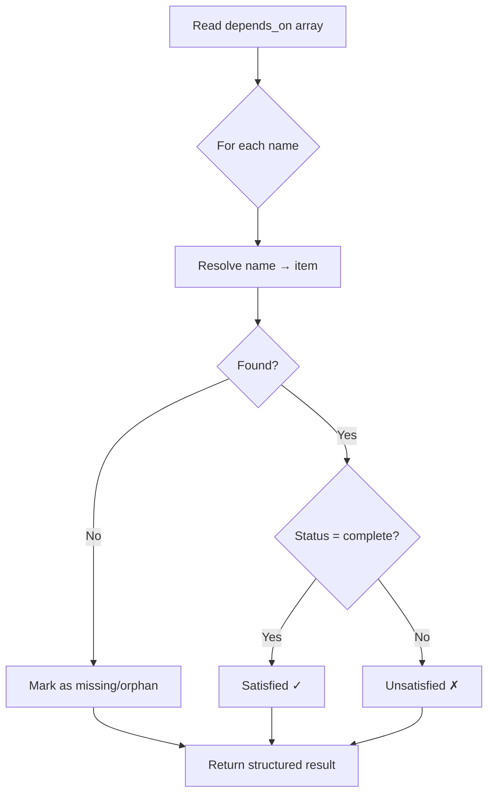
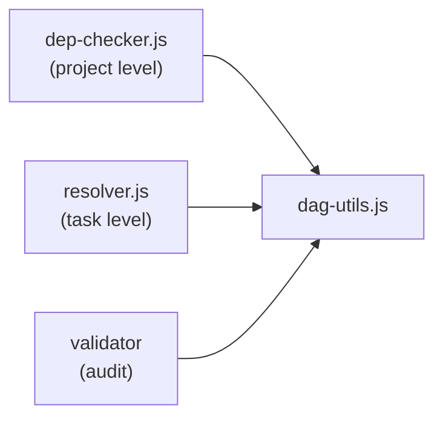
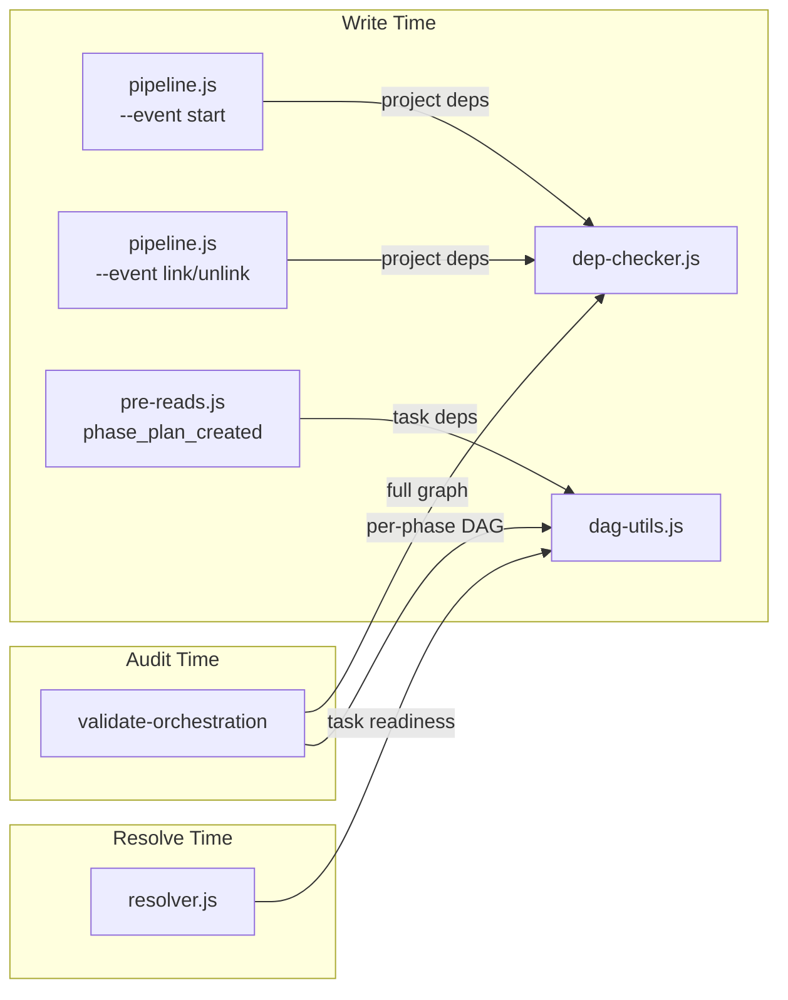

# Dependency Model

The orchestration system tracks dependencies at multiple levels. The same primitives — `depends_on`, name-based resolution, DAG enforcement — apply uniformly whether you're linking projects to projects or tasks to tasks within a phase.

## Levels



| Level | Scope | Container | Implemented by |
|-------|-------|-----------|----------------|
| **Project** | Cross-project ordering | All projects in `base_path` | PROJECT-CHAINING |
| **Phase** | Cross-phase ordering within a project | `execution.phases[]` | *Future — phases are sequential today* |
| **Task** | Intra-phase parallelism | `phases[].tasks[]` | PARALLEL-EXECUTION |

Every level follows the same rules:

1. `depends_on: string[]` — an array of names identifying what must complete first
2. **Names are the primitive** — resolution is contextual (project names resolve via `base_path`, task names resolve within the parent phase)
3. **DAG only** — no cycles. Validated at write time, audited systemically
4. **Backward-compatible** — absent or empty `depends_on` means no dependencies; existing data behaves identically to today

## Shared Vocabulary

These terms mean the same thing at every level:

| Term | Meaning |
|------|---------|
| `depends_on` | Array of names this item must wait for before starting |
| **satisfied** | All entries in `depends_on` have reached `complete` status |
| **blocked** | At least one `depends_on` entry is not yet complete |
| **ready** | No unsatisfied dependencies — eligible for execution |
| **cycle** | A circular reference chain (A → B → A). Always rejected |
| **orphan** | A `depends_on` entry that references a name that doesn't exist |

## Dependency Resolution



Resolution is contextual by level:

| Level | Name resolves to | Resolution path |
|-------|------------------|-----------------|
| Project | A project directory | `{base_path}/{NAME}/state.json`, fallback `{base_path}/_archived/{NAME}/state.json` |
| Task | A sibling task in the same phase | Lookup by `name` in `phases[n].tasks[]` |
| Phase *(future)* | A sibling phase in the same project | Lookup by `name` in `execution.phases[]` |

## Shared Utility: `dag-utils.js`

Both project-level and task-level dependency checking consume a common DAG utility module. The module is level-agnostic — it operates on abstract nodes and edges, not on state.json shapes directly.



Core operations:

| Function | Purpose |
|----------|---------|
| `detectCycle(startNode, getEdges)` | Walk the graph from a node; return `{ hasCycle, path[] }` |
| `topologicalSort(nodes, getEdges)` | Return nodes in dependency order; throw on cycle |
| `findReady(nodes, getEdges, isComplete)` | Return all nodes whose deps are satisfied |
| `buildGraph(nodes, getEdges)` | Return `{ nodes[], edges[] }` for visualization/audit |

Each caller provides its own `getEdges` function that knows how to extract `depends_on` from its level's data shape. The DAG utilities never import state.json, task objects, or project objects — they receive abstract nodes and a neighbor-lookup function.

## State Placement

Dependencies appear at predictable, consistent locations in `state.json`:

```
state.json
├── project.depends_on: string[]          ← project-level (PROJECT-CHAINING)
└── execution.phases[]
    ├── phases[].depends_on: string[]     ← phase-level (future)
    └── phases[].tasks[]
        └── tasks[].depends_on: string[]  ← task-level (PARALLEL-EXECUTION)
```

Same field name, same type, same semantics at every nesting depth. The nesting itself provides the scoping context.

## Scheduling (Task Level)

PARALLEL-EXECUTION extends the phase object with scheduling state to support concurrent task dispatch:

| Field | Type | Purpose |
|-------|------|---------|
| `max_concurrent` | `number` | Concurrency ceiling (default: `1` = sequential) |
| `ready_queue` | `number[]` | Task indices eligible to start (deps satisfied, not yet dispatched) |
| `in_flight` | `number[]` | Task indices currently executing |

This scheduling model is scoped to the task level today. A future project-level scheduler (for multi-project automation) would follow the same pattern: track which projects are ready, which are in-flight, and respect a concurrency limit.

## Enforcement Points



| When | What | Who |
|------|------|-----|
| **Project start** | All project deps must be satisfied | `dep-checker.js` via pipeline engine |
| **Link/unlink** | No cycles introduced; target exists | `dep-checker.js` via pipeline engine |
| **Phase plan created** | Task dep graph is a valid DAG; no orphan refs | `dag-utils.js` via pre-reads |
| **Task dispatch** | Only ready tasks (deps complete) are dispatched | `dag-utils.js` via resolver |
| **Validator audit** | Full cross-project graph + per-phase DAGs are healthy | Both modules |

## Phase-Level Dependencies

Phases are strictly sequential today — phase 2 cannot start until phase 1 completes. The dependency model naturally extends to phases (same `depends_on` field, same DAG utilities), but cross-phase parallelism is explicitly out of scope for both PROJECT-CHAINING and PARALLEL-EXECUTION.

When a future project adds phase-level dependencies, the pattern is already established:
- Add `depends_on: string[]` to the phase object in state.json
- Call `dag-utils.js` for cycle detection and readiness checks
- Add a `max_concurrent_phases` config option
- Extend the resolver to evaluate multiple ready phases

No new abstractions needed — the same vocabulary, the same utilities, the same enforcement pattern.
