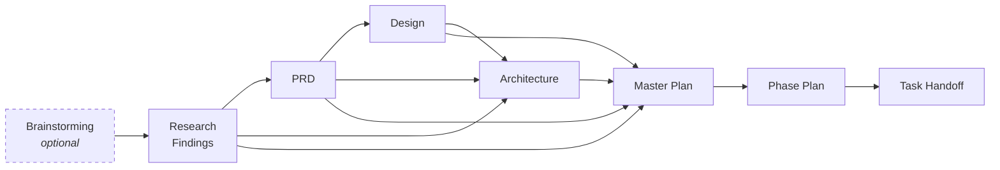
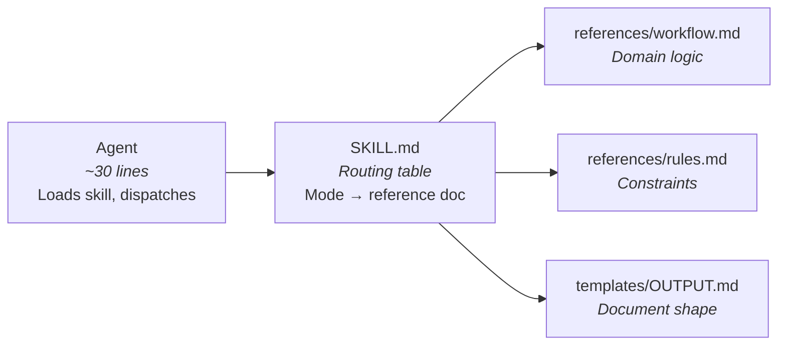
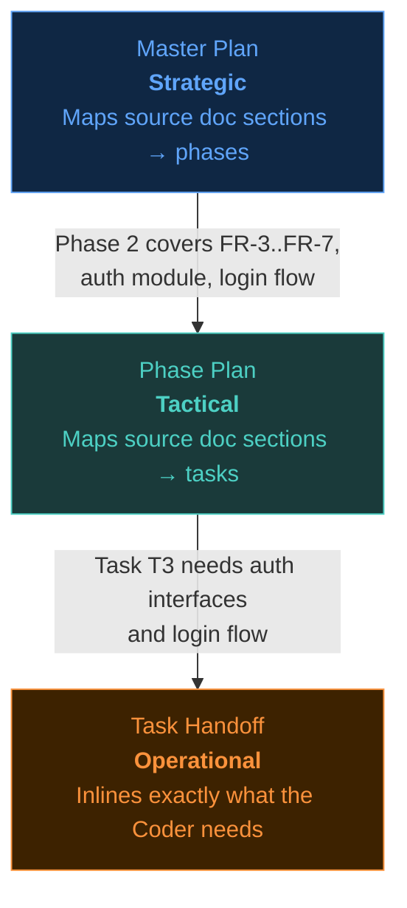
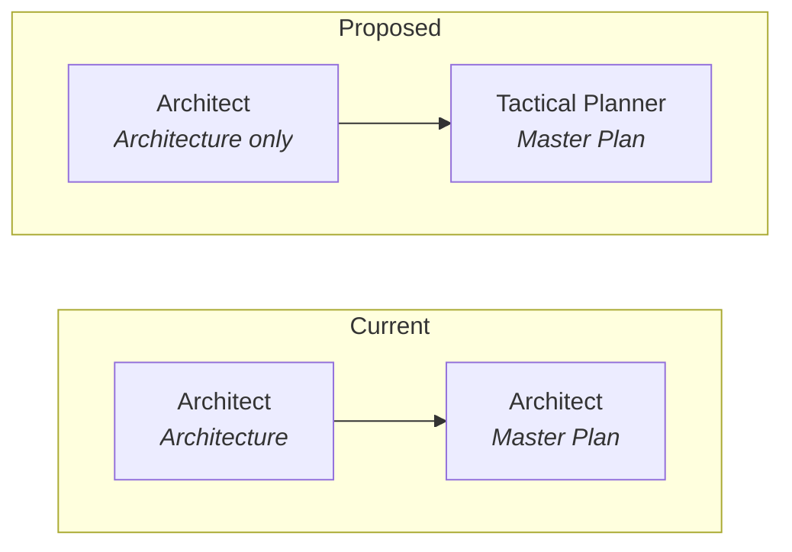
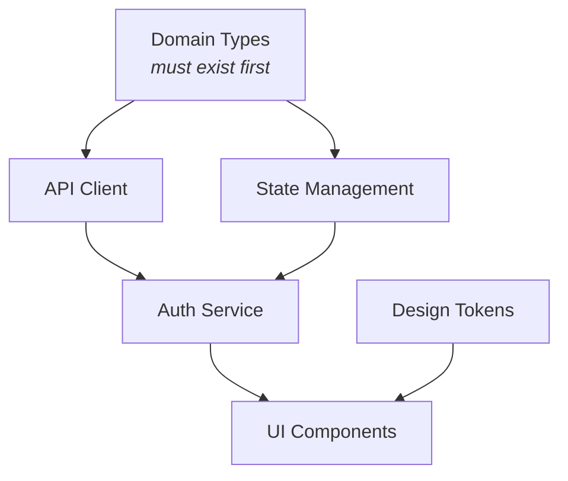
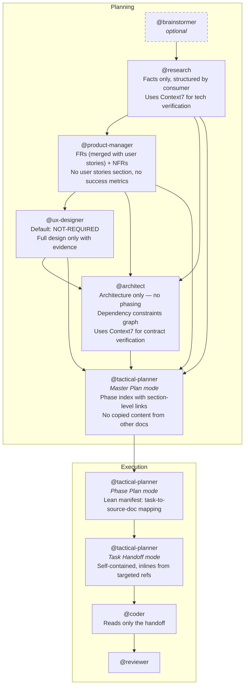
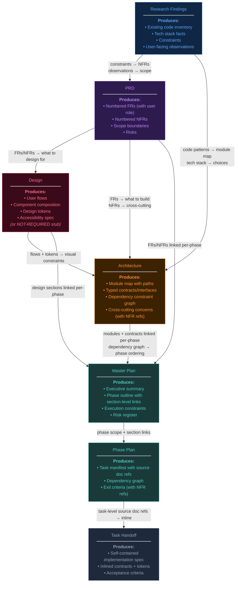

# Planning Pipeline Overhaul

A comprehensive analysis and reform plan for the orchestration system's planning pipeline — agents, skills, document templates, and the information flow between them. This document captures the full scope of identified problems and agreed-upon solutions, intended to be split into actionable brainstorming documents for phased execution.

---

## Current State

The planning pipeline transforms a project idea into executable work through a chain of specialized agents, each producing a structured document that feeds the next:



Each agent loads a primary skill (SKILL.md), which contains the full workflow, rules, and template reference. Agents duplicate significant portions of their skill's content — the same workflow, rules, and quality standards appear in both the `.agent.md` and the `SKILL.md`.

### What Works

- **Research findings are factual and evidence-based.** Reviewed across SCHEMA-OVERHAUL-2, V4-DOCUMENTATION, and SKILL-RECOMMENDATION — Research consistently reports what exists in the codebase without injecting opinion.
- **Architecture clearly defines contracts and dependencies.** TypeScript interfaces, module maps, and file structure give downstream agents concrete targets.
- **Project complexity drives appropriate documentation depth.** Simple projects get lighter docs; complex projects get appropriately detailed ones.
- **Traceability exists** via FR-1/NFR-1 cross-references from PRD through Architecture into Phase Plans.
- **Design triage templates exist** (Full, Flows-Only, Not-Required) — the mechanism is there, just under-enforced.
- **Task Handoff self-containment** keeps Coders focused on exactly what they need to do.
- **Pipeline engine mechanics** (state.json mutations, event routing, frontmatter validation) are solid.

### What Doesn't Work

The documents were designed independently and then chained together, rather than designed as a cohesive system. Each agent/skill is well-crafted in isolation, but the pipeline has emergent problems:

1. **Agent/Skill duplication** — Agents repeat their skill's workflow verbatim. Neither follows the thin-router pattern established by the Source Control agent.
2. **Cross-document repetition** — Requirements stated in the PRD get re-stated in Architecture ("Cross-Cutting Concerns"), then re-stated again in the Master Plan ("Key Requirements from PRD"). Each repetition is a subset, creating gap risk.
3. **Master Plan as a copy, not a map** — The Master Plan excerpts content from other docs instead of linking to them. This creates staleness risk and a false sense of completeness when it only captures a subset.
4. **Design overproduction** — The Designer creates full design documents for non-UI projects. The triage step exists in the skill but isn't enforced strongly enough. Default behavior should be NOT-REQUIRED, not Full Design.
5. **Research makes recommendations** — The "Recommendations" section crosses into PM/Architect territory. Research should report facts; interpretation belongs downstream.
6. **Architecture dictates phases** — The "Phasing Recommendations" section oversteps into the Planner's domain. Architecture should define structural dependencies, not execution order.
7. **PRD is bloated** — User stories, functional requirements, non-functional requirements, risks, assumptions, and success metrics create overlapping descriptions of the same things. User stories and FRs describe the same requirements in two formats.
8. **No Context7 MCP usage** — Planning agents don't look up latest documentation for technology choices, frameworks, or libraries. They rely on training data which may be outdated.
9. **Weak funnel** — The information flow from strategic (Master Plan) to tactical (Phase Plan) to operational (Task Handoff) doesn't progressively scope. The Phase Plan re-reads entire source docs instead of following targeted links from the Master Plan.

---

## Reform Principles

Three principles guide every change:

### 1. Thin Routing (Source Control Pattern)

The Source Control agent established a pattern: agent is a thin dispatcher, skill is a routing table to reference docs, reference docs contain all domain logic.



**Applied to planning**: Every planning agent becomes a thin router. Every planning skill becomes a routing table pointing to reference documents. All workflow steps, rules, and quality standards live in reference docs — not in the agent or SKILL.md.

### 2. High Signal, Low Repetition

Each document in the pipeline should have a **unique contribution** — content that appears nowhere else. When documents need to reference content from other docs, they **link** rather than **copy**.

| Document | Unique Contribution | Links To |
|----------|---------------------|----------|
| Research | Facts about the codebase and ecosystem | — (first in chain) |
| PRD | Requirements with priorities and scope boundaries | Research (for context) |
| Design | Visual decisions, flows, tokens, accessibility | PRD (requirements it addresses) |
| Architecture | Technical structure, contracts, dependencies | PRD (requirements it implements), Design (constraints it respects) |
| Master Plan | Phase definitions, scope-per-phase, execution strategy | All source docs via section-level links |
| Phase Plan | Task breakdown, dependency ordering, exit criteria | Master Plan (phase scope), source docs (per-task refs) |
| Task Handoff | Inlined implementation details, steps, acceptance criteria | Nothing (self-contained) |

### 3. Progressive Scoping Funnel

Each level of planning refines the previous level's mapping from broad to narrow:



- **Master Plan** scopes source doc sections to phases
- **Phase Plan** scopes source doc sections to tasks  
- **Task Handoff** inlines the targeted content for the Coder (self-contained)

The Tactical Planner doesn't re-read entire source docs to build handoffs — it follows the targeted links from the Phase Plan to inline exactly the right content.

---

## Agreed Reforms

### 1. Thin-Route All Planning Agents and Skills

**Current**: Agents contain full workflows and rules alongside their skills. Skills contain full workflows inline.

**Target**: Agents are thin dispatchers (~30 lines). Skills are routing tables. Reference docs hold all domain logic.

**Pattern for each planning skill**:

```
skills/{skill-name}/
├── SKILL.md                    # Routing table + loading instructions
├── references/
│   ├── workflow.md             # Step-by-step workflow
│   ├── rules.md                # Constraints, key rules, quality standards
│   └── {mode-specific}.md      # Mode-specific guidance (if applicable)
└── templates/
    └── OUTPUT.md               # Document template
```

**Agents affected**: Research, Product Manager, UX Designer, Architect, Tactical Planner (all 5 planning agents).

**Tactical Planner note**: Has the most complex routing (3 modes: phase plan, task handoff, phase report; plus corrective routing). All routing tables and corrective logic move to reference docs. The agent loads the skill and follows the routing table — same as Source Control.

### 2. Master Plan Becomes a Phase Index

**Current**: Master Plan excerpts "Key Requirements from PRD" (3-8 items), "Key Technical Decisions from Architecture" (3-8 items), "Key Design Constraints from Design" (3-8 items). These are subsets that create gap risk — the Planner may miss requirements not in the subset.

**Target**: Master Plan retains its unique contributions and links to source docs instead of copying from them.

**New Master Plan structure**:

| Section | Content | Change |
|---------|---------|--------|
| Executive Summary | 3-5 sentences, project orientation | Keep as-is |
| Source Documents | Table of all planning docs with paths | Keep as-is |
| ~~Key Requirements (from PRD)~~ | ~~Excerpted FR/NFR subset~~ | **Remove entirely** |
| ~~Key Technical Decisions (from Architecture)~~ | ~~Excerpted architectural decisions~~ | **Remove entirely** |
| ~~Key Design Constraints (from Design)~~ | ~~Excerpted design decisions~~ | **Remove entirely** |
| Phase Outline | Phases with goals, scope, exit criteria | **Reform: scope uses section-level links to source docs** |
| Execution Constraints | From `orchestration.yml` | Keep as-is |
| Risk Register | Aggregated risks | Keep (unique aggregation value) |

**Phase Outline reform example**:

```markdown
### Phase 2: Authentication & Session Management

**Goal**: Implement user authentication flow with session persistence.

**Scope**:
- [FR-3 through FR-7](PRD.md#functional-requirements) — auth requirements
- [Auth module contracts](ARCHITECTURE.md#auth-interfaces) — interfaces to implement
- [Login flow](DESIGN.md#login-flow) — user flow and states
- [NFR-2: Session timeout](PRD.md#non-functional-requirements) — 30-min idle timeout

**Exit Criteria**:
- [ ] All auth endpoints return correct responses
- [ ] Session persists across page reloads
- [ ] Login flow matches design spec
```

The Tactical Planner follows these links when creating the Phase Plan and Task Handoffs — it reads only the sections referenced, not entire docs.

### 3. Move Master Plan Ownership to the Tactical Planner

**Current**: The Architect agent creates both Architecture and Master Plan (two modes).

**Target**: The Architect creates Architecture only. The Tactical Planner creates the Master Plan.

**Rationale**:
- The Master Plan is fundamentally about **phasing and execution strategy**, not architecture
- The Tactical Planner is the primary **consumer** of the Master Plan — consumer-creates-contract alignment
- Each agent invocation is an isolated context window — no bias carryover from Architecture creation
- The Architect agent becomes simpler: one skill, one document, one mode
- The `create-master-plan` skill moves to the Tactical Planner alongside `create-phase-plan` and `create-task-handoff` — cohesive planning skills in one agent

**Pipeline flow change**:



**Orchestrator action routing change**: `spawn_master_plan` would spawn the Tactical Planner instead of the Architect. The event flow remains identical — only the agent target changes.

### 4. Research: Facts Only, Structured for Consumers

**Current**: Research has a "Recommendations" section and outputs a flat structure.

**Target**: Remove recommendations entirely. Structure output sections by downstream consumer.

**New Research Findings structure**:

| Section | Primary Consumer | What It Contains |
|---------|-----------------|------------------|
| Research Scope | All | 1-2 sentences: what was investigated and why |
| Existing Code & Patterns | Architect | Relevant files, modules, conventions, patterns already in use |
| Technology Stack | Architect | Languages, frameworks, versions, dependencies |
| External Research | Architect + PM | APIs, libraries, standards — factual findings from docs and Context7 |
| Constraints & Limitations | PM → NFRs | Technical constraints, compatibility issues, performance boundaries |
| User-Facing Observations | PM | Existing UX, user impact, scope implications |
| ~~Recommendations~~ | — | **Removed.** PM and Architect interpret facts. |

Research reports *what is*. The PM decides *what should be*. The Architect decides *how to build it*.

### 5. Design: Default to NOT-REQUIRED

**Current**: The Designer has three templates (Full, Flows-Only, Not-Required) but the triage step isn't enforced. The default behavior tends toward creating full design documents, even for non-UI projects.

**Target**: Invert the default. The Designer must **justify** why a full design is needed. When uncertain, produce the Not-Required stub.

**Triage enforcement**:
- The skill's triage step becomes the **first and mandatory** action
- Default classification is "Not required" — the Designer must find explicit evidence of visual UI in the PRD's user stories to upgrade
- Evidence required for Full Design: PRD user stories that describe visual interactions (viewing pages, clicking UI elements, form submission, layout changes)
- Evidence required for Flows-Only: PRD user stories that describe non-visual interactive flows (CLI wizards, interactive prompts)
- Absence of such evidence → Not Required

**For UI projects, Design remains valuable**: Component composition, visual hierarchy, design tokens, accessibility, and responsive behavior are genuine design concerns. The reform targets non-UI projects only.

### 6. PRD: Merge User Stories into FR Table

**Current**: PRD has separate sections for User Stories (table with As a/I want/So that) and Functional Requirements (FR table with ID/Requirement/Priority). These describe the same things in two formats.

**Target**: Single requirements table that captures both the user perspective and the requirement.

**New FR table format**:

| # | User Role | Requirement | Priority | Notes |
|---|-----------|------------|----------|-------|
| FR-1 | Developer | Pipeline validates phase plan frontmatter `tasks` array on creation | P0 | — |
| FR-2 | Pipeline operator | Corrective tasks reference original acceptance criteria | P1 | — |

This preserves the "who benefits" context from user stories while eliminating the redundant table. Each FR is still numbered for cross-referencing by downstream agents.

### 7. Architecture: Replace Phasing with Dependency Constraints

**Current**: Architecture has a "Phasing Recommendations" section that suggests execution phases (Phase 1: Foundation, Phase 2: Core, etc.).

**Target**: Replace with a "Dependency Constraints" section that documents which modules/components must exist before others — a dependency graph, not a phase plan.

**Example**:

## Dependency Constraints

The following structural dependencies constrain execution ordering. The Tactical Planner
uses these when determining phase boundaries and task sequencing.



- **Domain types** must exist before any service layer code — all services depend on shared type definitions
- **API client** depends on domain types for request/response shapes
- **Auth service** depends on both API client and state management
- **UI components** depend on auth service (data) and design tokens (styling)

The Tactical Planner interprets these constraints into phases. Architecture defines *what depends on what*. The Planner decides *when to build what*.

### 8. Context7 MCP Integration

**Current**: No planning agents use Context7 to look up latest documentation.

**Target**: Research and Architecture agents use Context7 MCP to verify technology choices against current docs.

| Agent | Context7 Usage |
|-------|---------------|
| Research | Look up library docs, API references, framework guides during discovery. Verify libraries are current, well-maintained, and not deprecated. |
| Architecture | Verify API contracts against latest framework docs. Check that interface patterns match current library versions. |
| Others | Not needed — they consume Research/Architecture findings. |

Both agents already have `context7/*` in their tools list. The reform is in the **skill reference docs** — the workflow steps explicitly instruct agents to use Context7 for tech verification.

### 9. Phase Plan: Lean Task Manifest

**Current**: Phase Plans describe each task in prose alongside the task outline table. This prose gets re-stated (and expanded) in the Task Handoff, making the Phase Plan description wasted context.

**Target**: Phase Plan becomes a lean manifest — task IDs, source doc section references, dependency graph, and exit criteria. No prose task descriptions.

**Phase Plan's unique contribution**: the mapping from source doc sections to tasks, and the dependency ordering. That's it.

**New task outline format**:

```markdown
| # | Task | Source Doc Refs | Dependencies | Handoff |
|---|------|----------------|-------------|---------|
| T1 | Domain types | [ARCH#types](ARCHITECTURE.md#domain-types) | — | [Link]() |
| T2 | API client | [ARCH#api-client](ARCHITECTURE.md#api-client), [FR-3..FR-5](PRD.md#functional-requirements) | T1 | [Link]() |
| T3 | Login UI | [DESIGN#login-flow](DESIGN.md#login-flow), [ARCH#login-component](ARCHITECTURE.md#login) | T1 | [Link]() |
```

The "Source Doc Refs" column tells the Tactical Planner exactly which sections to inline when creating the Task Handoff for that task. No guesswork.

### 10. Task Handoff: Keep Self-Containment

**Current**: Task Handoffs inline contracts, design tokens, and all context. The Coder reads only the handoff.

**Target**: No change to self-containment. This is correct and should stay.

The improvement comes upstream: because the Phase Plan now maps specific source doc sections to each task, the Planner knows exactly what to inline — reducing errors and ensuring completeness.

### 11. NFR Traceability

**Current**: NFRs defined in the PRD often get lost by execution time. Architecture acknowledges them in "Cross-Cutting Concerns" but there's no explicit trace from NFR → architectural decision → implementation constraint.

**Target**: Explicit NFR trace through the document chain.

- **PRD**: NFRs defined with IDs (NFR-1, NFR-2, etc.) — unchanged
- **Architecture**: Cross-Cutting Concerns section explicitly references NFR IDs: "NFR-2 (session timeout) → implemented via middleware TTL check"
- **Master Plan**: Phase exit criteria reference NFR IDs where applicable: "NFR-3 (WCAG AA) verified for all new components"
- **Phase Plan**: Exit criteria carry NFR references forward
- **Task Handoff**: NFR-derived constraints inlined as acceptance criteria

---

## Revised Pipeline Flow



### Key Differences from Current

| Aspect | Current | Proposed |
|--------|---------|----------|
| Agent architecture | Agents contain full workflows | Agents are thin routers to skills |
| Skill architecture | Skills contain full workflows inline | Skills are routing tables to reference docs |
| Master Plan author | Architect | Tactical Planner |
| Master Plan content | Excerpts from PRD/Arch/Design | Phase index with links to source doc sections |
| Research output | Free-form with recommendations | Structured by consumer, facts only |
| Design default | Tends toward full design | Defaults to NOT-REQUIRED |
| PRD shape | User stories + FRs + NFRs + metrics | FRs (with user role) + NFRs + risks |
| Architecture phasing | "Phasing Recommendations" | "Dependency Constraints" (graph) |
| Phase Plan detail | Prose task descriptions | Lean manifest with source doc refs |
| Context7 usage | None | Research + Architecture |
| NFR tracing | Implicit, often lost | Explicit IDs traced through all docs |

---

## Document Handoff Chain (Revised)

How each document feeds the next, with explicit contracts:



---

## Scope of Changes

### Files to Modify

**Agents** (5 agents → thin routers):
| Agent | File | Change |
|-------|------|--------|
| Research | `.github/agents/research.agent.md` | Strip to thin router |
| Product Manager | `.github/agents/product-manager.agent.md` | Strip to thin router |
| UX Designer | `.github/agents/ux-designer.agent.md` | Strip to thin router |
| Architect | `.github/agents/architect.agent.md` | Strip to thin router, remove Mode 2 (Master Plan) |
| Tactical Planner | `.github/agents/tactical-planner.agent.md` | Strip to thin router, add Mode 0 (Master Plan) |

**Skills** (7 skills → routing tables + reference docs):
| Skill | Directory | Change |
|-------|-----------|--------|
| `research-codebase` | `.github/skills/research-codebase/` | SKILL.md → routing table; create `references/` with workflow + rules |
| `create-prd` | `.github/skills/create-prd/` | SKILL.md → routing table; create `references/`; update template (merge user stories into FRs, drop success metrics) |
| `create-design` | `.github/skills/create-design/` | SKILL.md → routing table; create `references/`; strengthen triage enforcement (default NOT-REQUIRED) |
| `create-architecture` | `.github/skills/create-architecture/` | SKILL.md → routing table; create `references/`; update template (replace Phasing Recommendations with Dependency Constraints) |
| `create-master-plan` | `.github/skills/create-master-plan/` | SKILL.md → routing table; create `references/`; update template (remove copied sections, add section-level phase links) |
| `create-phase-plan` | `.github/skills/create-phase-plan/` | SKILL.md → routing table; create `references/`; update template (lean manifest with source doc refs) |
| `create-task-handoff` | `.github/skills/create-task-handoff/` | SKILL.md → routing table; create `references/`; no template change (self-containment preserved) |

**Templates** (5 templates updated):
| Template | Change |
|----------|--------|
| `RESEARCH-FINDINGS.md` | Restructure sections by consumer; remove Recommendations |
| `PRD.md` | Merge User Stories into FR table; drop Success Metrics |
| `ARCHITECTURE.md` | Replace Phasing Recommendations with Dependency Constraints |
| `MASTER-PLAN.md` | Remove copied sections; reform Phase Outline with section-level links |
| `PHASE-PLAN.md` | Lean task manifest with source doc refs column |

**Pipeline changes** (minimal):
| Change | Impact |
|--------|--------|
| `spawn_master_plan` action target | Orchestrator spawns Tactical Planner instead of Architect |
| Orchestrator pipeline guide | Update action routing table entry #5 |

### Files NOT Modified

- Task Handoff template — self-containment preserved
- Pipeline engine (`pipeline.js`, `mutations.js`, etc.) — no state schema changes
- `state.json` schema — no structural changes
- Review skill (`code-review`) — consolidated, three modes
- Coder agents — they only read handoffs, unaffected
- Source Control agent/skill — already follows the target pattern
- `orchestration.yml` — no configuration changes needed

---

## Potential Project Splits

This work can be divided into independent projects that build on each other:

### Split A: Structural Reform (Thin Routing + Templates)

**Description**: Convert all planning agents to thin routers, restructure all planning skills to routing-table + reference-doc pattern, and update all document templates.

**Why first**: This is the structural foundation. All other reforms (Master Plan ownership, Context7, etc.) layer on top of the thin-routing pattern. Doing this first means subsequent projects modify clean, well-structured reference docs instead of monolithic SKILL.md files.

**Scope**: 5 agents, 7 skills, 5 templates. No pipeline engine changes.

### Split B: Document Content Reform

**Description**: Implement the substantive changes to what each document contains — Research facts-only, PRD FR/story merge, Design triage enforcement, Architecture dependency constraints, Master Plan as phase index, Phase Plan as lean manifest, NFR traceability.

**Why second**: With the thin-routing structure in place, these changes are edits to reference docs and templates — clean, targeted modifications.

**Scope**: Reference docs and templates within the 7 skills. May involve the Master Plan ownership change (moving `create-master-plan` to Tactical Planner).

### Split C: Context7 Integration + Master Plan Ownership

**Description**: Add Context7 MCP usage instructions to Research and Architecture workflows. Move Master Plan creation from Architect to Tactical Planner.

**Why third (or combined with B)**: These are smaller, targeted changes. Context7 is additive — adding instructions to existing reference docs. Master Plan ownership is a pipeline routing change + skill assignment change.

### Alternative: Single Project

All reforms in one `PLANNING-OVERHAUL` project with phases aligning to the splits above. Advantage: holistic design, ensures cohesion. Risk: larger scope per pipeline run.

---

## Open Questions

1. **Naming**: If the Tactical Planner also creates the Master Plan, should it be renamed to just "Planner"? The current name implies tactical-only scope.

2. **Anchor granularity**: Section-level links in the Master Plan (e.g., `PRD.md#functional-requirements`) are coarse. Should we support finer-grained links (e.g., individual FR anchors)? This affects template structure.

3. **Reviewer impact**: The Reviewer currently validates against PRD, Architecture, and Design. If these templates change, the review skill (`code-review`) may need updates to match new section structures. Should this be in-scope or a follow-up?

4. **Validation script**: The orchestration validator checks document frontmatter and structure. Template changes may require validator updates. Scope this in or defer?

5. **Migration**: Existing projects use current templates. Do we need migration support, or do changes only affect new projects? (Likely: new projects only — existing projects are already in execution or complete.)
