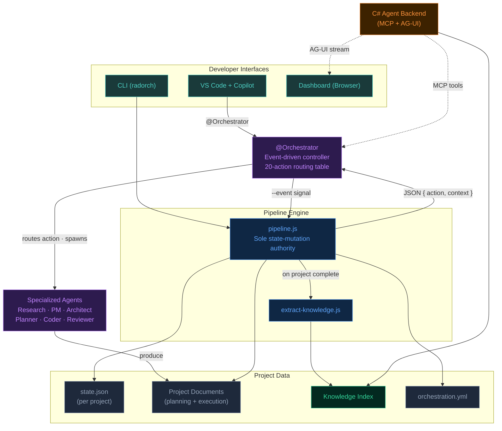
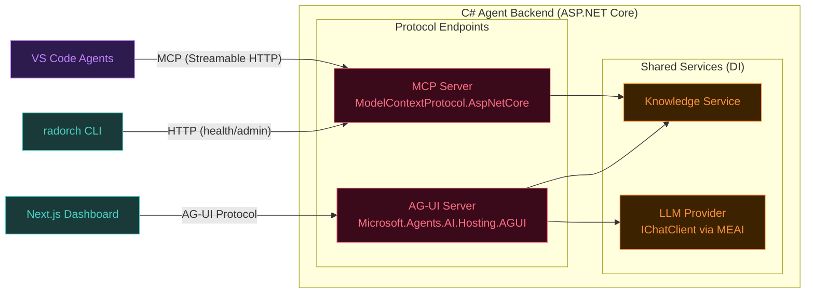
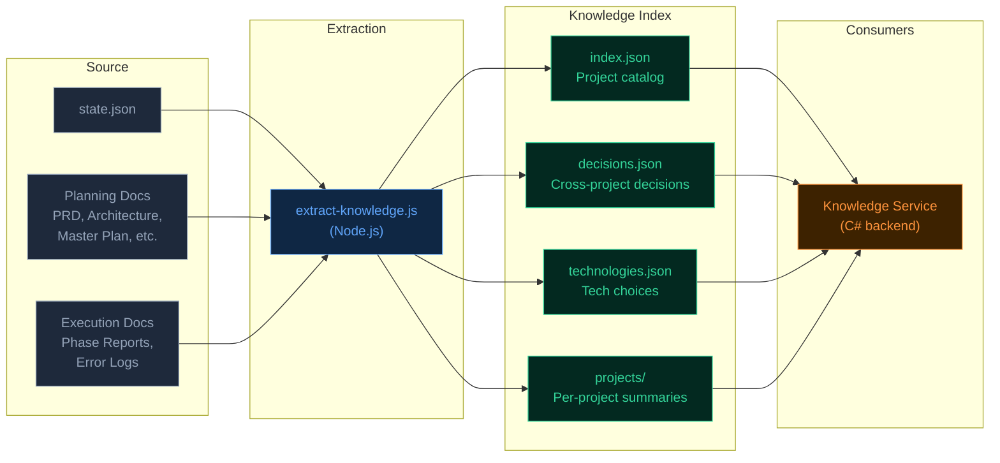
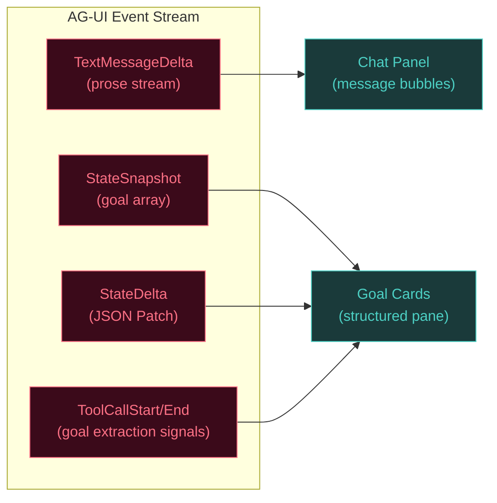
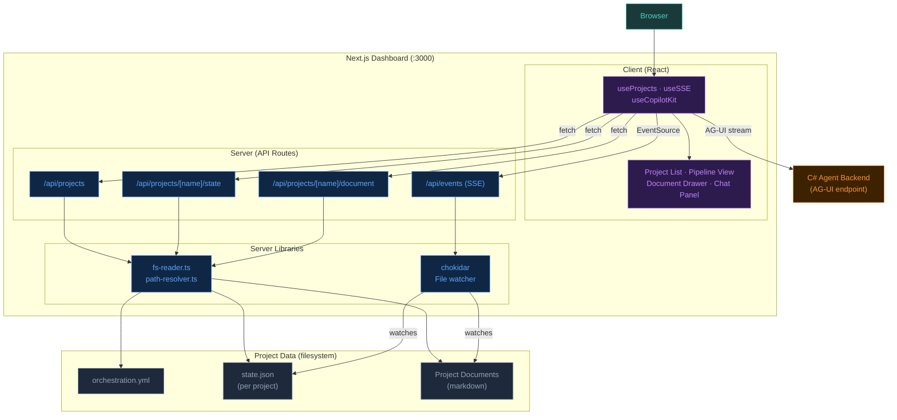
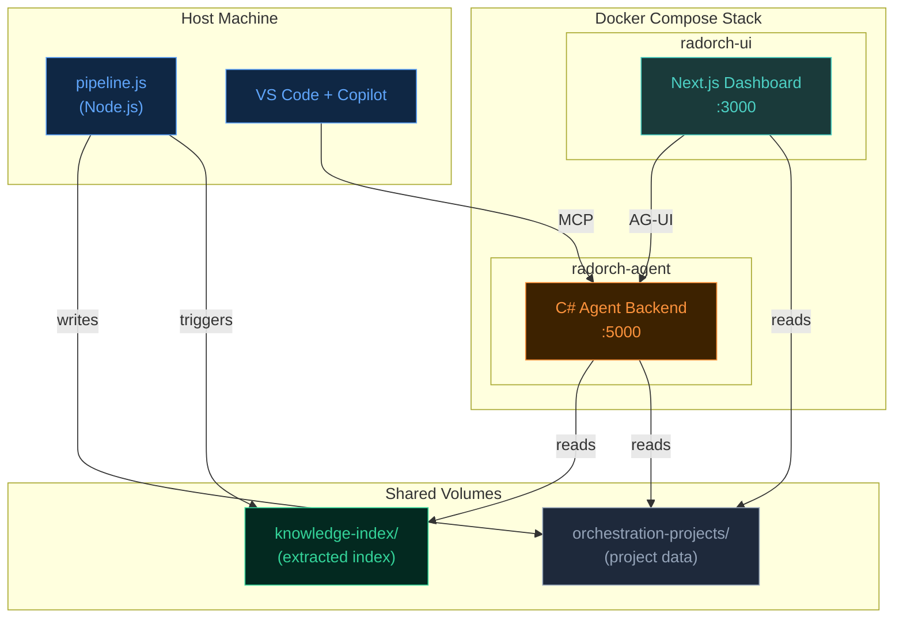
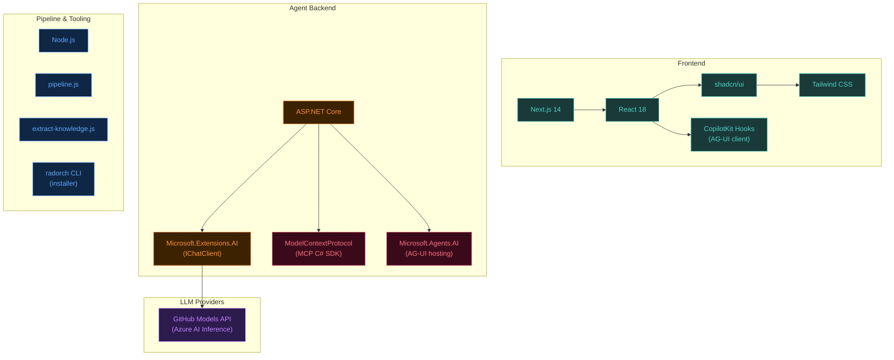
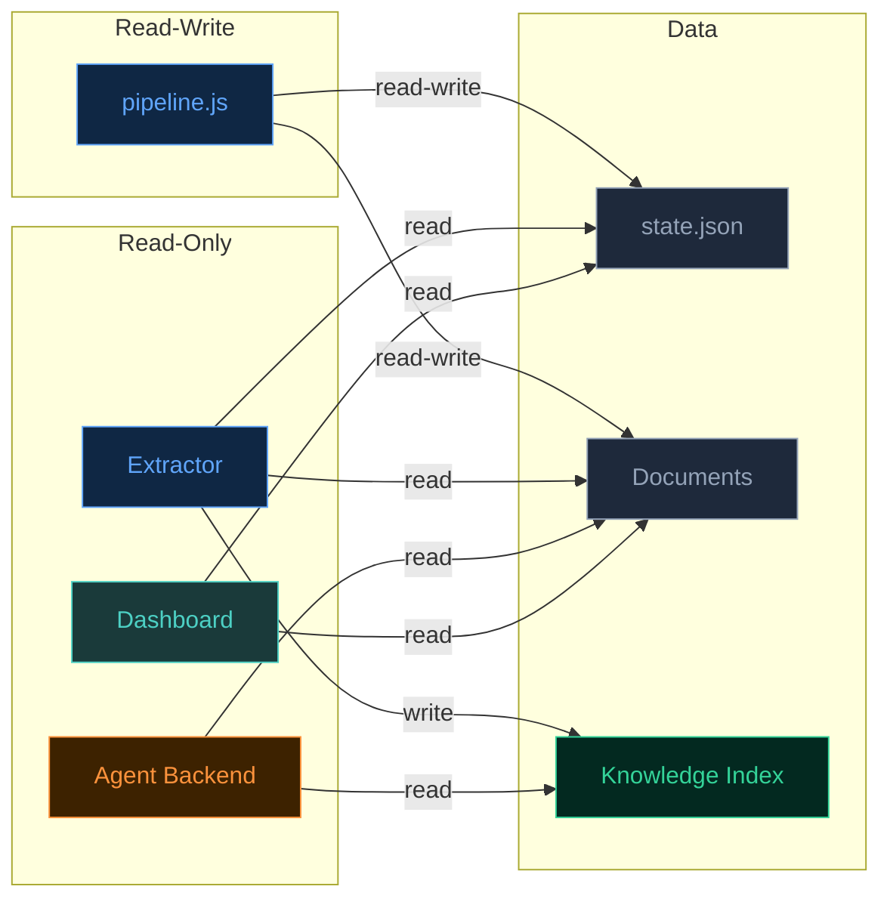

# System Architecture

A high-level view of the orchestration system's runtime architecture — the services, protocols, data flows, and integration points that connect project execution, agent intelligence, and human interaction into a single working system.

This document complements [pipeline.md](../pipeline.md) (how projects move through tiers) and [dependency-model.md](dependency-model.md) (how dependencies work across levels). Where those are depth-focused, this is breadth-focused: how every major subsystem relates to every other.

---

## System Overview

**Key principles**: Both VS Code Copilot and the CLI funnel through `pipeline.js` — it is the single entry point for all state mutations. The Orchestrator runs inside Copilot as an event-driven controller: it signals events to `pipeline.js`, receives a JSON action result, and routes on a 20-action table to spawn the appropriate specialized agent. Knowledge flows in the opposite direction — from project data up through the extractor and index back to agents via MCP tools. Dotted lines indicate knowledge-system connections (planned).

---

## Service Architecture

The C# agent backend is a single ASP.NET Core application hosting multiple protocol endpoints. Each endpoint serves a different consumer but shares the same underlying services.

### Protocol Responsibilities

| Protocol | Package | Consumer | Purpose |
|----------|---------|----------|---------|
| **MCP** | `ModelContextProtocol.AspNetCore` | VS Code pipeline agents | Expose knowledge tools (search, retrieve, summarize) |
| **AG-UI** | `Microsoft.Agents.AI.Hosting.AGUI.AspNetCore` | Next.js chat panel | Stream brainstorming conversations, sync goal state |
| **HTTP** | ASP.NET Core minimal APIs | CLI, health checks | Index rebuild trigger, service status |

### Why One Service, Two Protocols

The Brainstormer chat agent and the knowledge tools share the same data and the same need for LLM access. Splitting them into separate services would duplicate the knowledge service, require inter-service communication for context injection, and double the container footprint. A single service with two endpoints is simpler to deploy, configure, and reason about.

---

## Knowledge System

The knowledge system gives agents memory across projects. It has two parts: an extraction pipeline that builds a structured index from project artifacts, and a query service that makes that index searchable.

### Data Flow

### Extraction Pipeline

The extractor is a Node.js script — consistent with the pipeline engine, installer, and existing scripts. It scans every project directory (including `_archived/`), parses known document sections using the templated structure, and writes structured JSON index files to a configurable path defined in `orchestration.yml`.

**Why Node.js for extraction, C# for serving?** The extractor runs in the same ecosystem as `pipeline.js` and needs to parse the same frontmatter, resolve the same paths, and understand the same state.json schema. The C# backend loads pre-built JSON files — it doesn't need to know how to parse markdown templates.

### What Gets Extracted

The system's templated documents have predictable structure. The extractor exploits this — it knows exactly where decisions live in an architecture doc, where requirements live in a PRD, and where outcomes live in phase reports.

| Source | Extracted Atoms |
|--------|----------------|
| `state.json` | Project name, tier, gate mode, phase/task counts, created/updated timestamps, review verdicts, retry counts |
| Brainstorming | Problem statement, validated goals (name + rationale), scope boundaries |
| PRD | Functional requirements (ID, description, priority), non-functional requirements, user stories |
| Architecture | Technical decisions, module map, technology choices, dependency graph |
| Master Plan | Executive summary, key requirements, phase outlines with exit criteria |
| Phase Reports | Exit criteria assessment, carry-forward items, adjustment recommendations |
| Error Logs | Structured entries: event, severity, root cause, workaround applied |
| Final Reviews | Per-requirement coverage assessment, overall verdict |

### Index Freshness

The index rebuilds on **pipeline-triggered events** — specifically when a project reaches `complete` tier. The extractor is a standalone script callable two ways:

- **Pipeline hook**: `pipeline.js` invokes it after writing `pipeline.current_tier = "complete"`
- **CLI command**: `radorch index rebuild` for manual refresh

Incremental updates (single-project re-index) are a natural optimization but not required for V1 — a full rebuild across ~40 projects completes in seconds.

---

## Chat System

The dashboard's embedded chat panel connects the Brainstormer agent directly to the UI, eliminating the context switch between the monitoring dashboard and VS Code for project ideation.

### Conversation Flow

```mermaid
sequenceDiagram
    participant U as User (Browser)
    participant N as Next.js Dashboard
    participant A as Dotnet Agent Backend
    participant L as LLM Provider

    U->>N: Types message in chat panel
    N->>A: AG-UI RunRequest (HTTP stream)
    A->>L: Chat completion (IChatClient)
    L-->>A: Streamed response tokens
    A-->>N: AG-UI TextMessageStart/Delta/End events
    A-->>N: AG-UI StateSnapshot (goal cards)
    N-->>U: Renders streamed text + live goal cards

    rect rgb(26, 58, 58)
        Note over U,N: Human Layer
    end
```

### State Synchronization

The chat conversation and the goal cards are synchronized through AG-UI's state management events — not by parsing the prose stream. The agent backend maintains a typed goal array as shared state, pushing `StateSnapshot` and `StateDelta` (JSON Patch) events alongside the text stream. The frontend renders them independently.

### Knowledge Injection

When the Brainstormer starts a conversation, the knowledge service automatically injects relevant context from past projects — similar problems solved, technologies previously chosen, patterns established. This happens via the shared `KnowledgeService` that both the MCP and AG-UI endpoints access.

---

## UI Architecture

The Next.js dashboard is a read-only monitoring and interaction layer. It reads project data from the filesystem via server-side API routes, receives live updates through SSE driven by a file watcher, and streams chat through the C# agent backend via AG-UI.

### Data Flow Patterns

| Pattern | Mechanism | Path |
|---------|-----------|------|
| **Initial load** | HTTP fetch | Browser → `useProjects` → `/api/projects` → `fs-reader` → filesystem |
| **Project state** | HTTP fetch | Browser → `useProjects` → `/api/projects/[name]/state` → `readProjectState` → `state.json` |
| **Document view** | HTTP fetch | Browser → Document Drawer → `/api/projects/[name]/document` → `readDocument` → markdown file |
| **Live updates** | SSE (Server-Sent Events) | `chokidar` watches `state.json` + docs → debounced SSE push → `useSSE` → React state update |
| **Chat** | AG-UI stream | Browser → `useCopilotKit` → C# Agent Backend → LLM → streamed response |

### Why Read-Only

The dashboard never writes to `state.json` or project documents. All mutations flow through `pipeline.js` (the single-writer guarantee from the System Overview). The UI observes state changes via the file watcher — when `pipeline.js` writes `state.json`, `chokidar` detects the change and pushes an SSE event to all connected browsers. This means multiple browser tabs stay in sync automatically.

---

## Deployment Topology

The C# agent backend runs as a Docker container alongside the existing Next.js dashboard container. Both mount the project data and knowledge index as shared volumes. The pipeline engine runs on the host machine (inside VS Code's terminal) and triggers index rebuilds on project completion.

### Container Responsibilities

| Container | Base Image | Ports | Volumes |
|-----------|-----------|-------|---------|
| `radorch-ui` | Node.js Alpine | 3000 | `orchestration-projects/` (read) |
| `radorch-agent` | .NET Alpine | 5000 | `orchestration-projects/` (read), `knowledge-index/` (read) |

The installer (`radorch` CLI) generates Docker Compose configuration for both containers and provisions environment variables (LLM endpoint, API keys, paths).

---

## Technology Stack

### Key Integration Points

| Integration | Protocol | Direction | Notes |
|------------|----------|-----------|-------|
| VS Code → Agent Backend | MCP (Streamable HTTP) | Agent calls tools | Official MCP C# SDK; `[McpServerTool]` attribute-based discovery |
| Dashboard → Agent Backend | AG-UI (HTTP stream) | UI streams chat | CopilotKit headless hooks on frontend; MAF hosting on backend |
| Agent Backend → LLM | MEAI `IChatClient` | Backend calls model | Provider-swappable via single DI registration |
| Pipeline → Knowledge Index | File I/O | Pipeline writes, backend reads | Atomic write (temp + rename); shared volume in Docker |
| Pipeline → State | File I/O | Pipeline reads/writes | `pipeline.js` is sole writer; all others read-only |

---

## Cross-Cutting Concerns

### Configuration

All runtime configuration flows from `orchestration.yml`:

| Setting | Purpose | Consumer |
|---------|---------|----------|
| `projects.base_path` | Root directory for all project data | Pipeline, extractor, dashboard, agent backend |
| `knowledge.index_path` | Where the knowledge index lives | Extractor (write), agent backend (read) |
| `agent.llm_provider` | LLM endpoint + model configuration | Agent backend |
| `agent.port` | Agent backend listen port | Docker compose, MCP client config |

### Security Boundaries

**Single-writer guarantee**: `pipeline.js` is the only process that writes `state.json`. The knowledge extractor writes only to the index directory. The agent backend and dashboard are strictly read-only over project data. This eliminates write contention and race conditions without locks.

### Error Handling Philosophy

- **Pipeline errors** → structured error log (`*-ERROR-LOG.md`), pipeline halts, human gate triggered
- **Knowledge index errors** → graceful degradation; agents work without knowledge, queries return empty results
- **Agent backend errors** → standard ASP.NET Core error handling; chat sessions are stateless and resumable
- **MCP tool errors** → MCP protocol error responses; VS Code surfaces them to the user

### Observability

The pipeline produces a complete audit trail by design — every state transition, every document, every review verdict is written to disk. The knowledge system makes this audit trail queryable. No additional telemetry infrastructure is needed for V1.

---

## Evolution Path

This architecture is designed to grow without rewrites:

| Capability | Current State | Next Step | What Changes |
|-----------|---------------|-----------|--------------|
| **Knowledge retrieval** | Structured JSON index, keyword search | Add vector embeddings (SQLite-vec or LanceDB) | Knowledge service gains a similarity search method; MCP tools unchanged |
| **Chat agents** | Brainstormer only | Additional agent types (Research, Planner) | New AG-UI agent registrations in DI; same endpoint |
| **LLM provider** | GitHub Models API | Any MEAI-compatible provider | One DI registration change |
| **Index freshness** | Rebuild on project complete | File watcher for incremental updates | Extractor gains watch mode; index format unchanged |
| **UI graph** | Read-only dependency visualization | Drag-and-drop dependency editing | UI calls pipeline events (`link_project`, `unlink_project`) |
| **Multi-project automation** | Manual project start | Chain runner / continuous queue | Orchestrator layer above pipeline; pipeline API unchanged |
