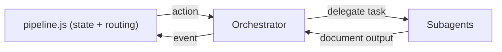
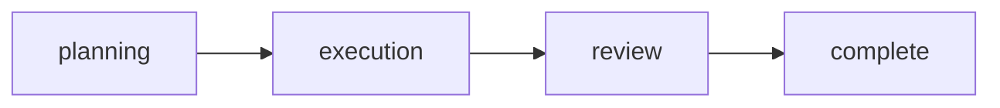
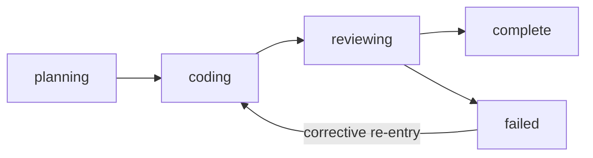
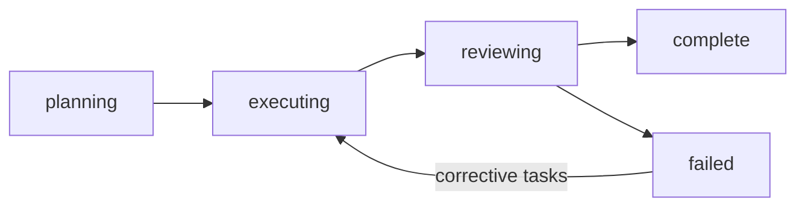
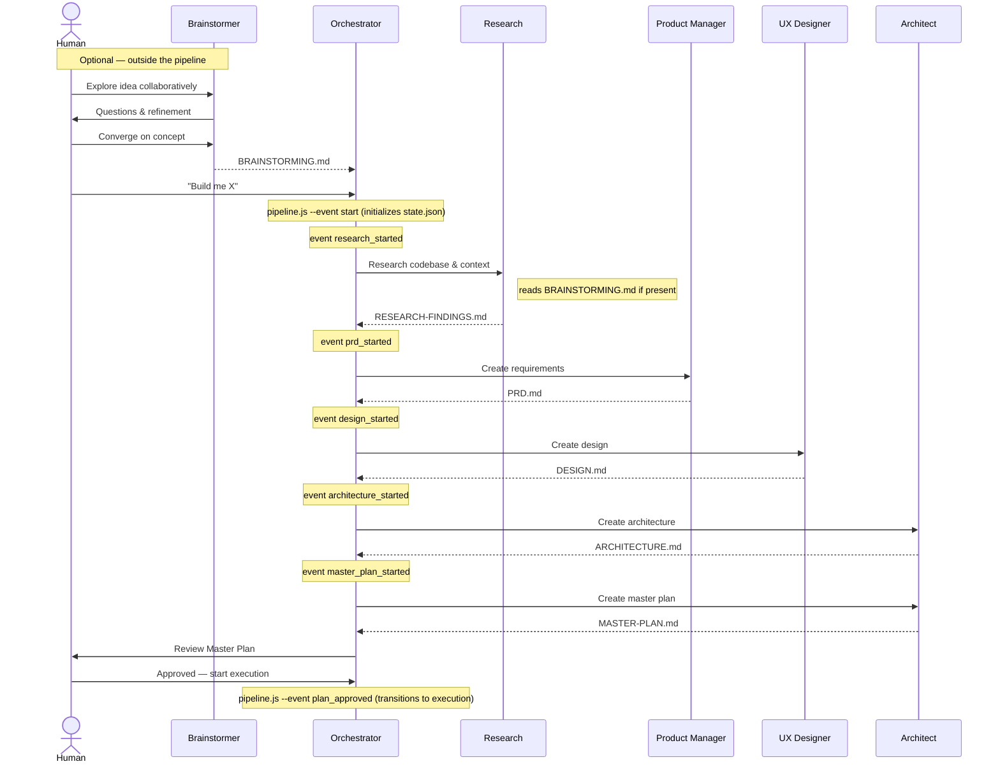
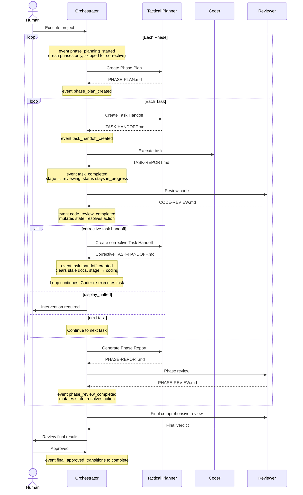

# Pipeline

The orchestration pipeline takes a project from idea through planning, execution, and review. The Orchestrator operates as an event-driven controller: it signals events to `pipeline.js`, parses JSON results, and routes on a 20-action table. The pipeline script (`pipeline.js`) is the sole state-mutation authority — it internalizes all state transitions, validation, and next-action resolution to maximize determinism in your agentic SDLC.



## Pipeline Tiers

The pipeline progresses through four major tiers:



A project can also be `halted` from any tier when a critical error occurs or a human gate is not satisfied.

## Status vs. Stage

The system tracks work progress at two levels of granularity on every task and phase:

| Field | Purpose | Values |
|-------|---------|--------|
| `status` | Coarse pipeline gate — controls tier advancement and human gates | `not_started`, `in_progress`, `complete`, `failed`, `halted` |
| `stage` | Precise work focus within a status — controls what the next agent action is | See lifecycle diagrams below |

**Why two fields?** `status` alone cannot distinguish "started but still coding" from "started but waiting for review". The `stage` field fills this gap: the resolver matches on `stage` to determine the correct next action rather than inferring it from the presence or absence of doc paths.

### Task Stage Lifecycle



| Stage | Meaning |
|-------|---------|
| `planning` | Tactical Planner is creating (or re-creating) the task handoff |
| `coding` | Coder is executing the task |
| `reviewing` | Reviewer is evaluating the code |
| `complete` | Code review approved — terminal |
| `failed` | Review verdict was `changes_requested` — Tactical Planner creates a corrective task handoff to re-enter at `coding` if retries remain; terminal if retries exhausted |

> **Note:** `reporting` is a reserved enum value in the schema but is not set by any current mutation handler.

Allowed task stage transitions:

See [constants.js](../.github/skills/orchestration/scripts/lib/constants.js) for the full transition map.

### Phase Stage Lifecycle



| Stage | Meaning |
|-------|---------|
| `planning` | Tactical Planner is creating the phase plan. Phase starts as `not_started / planning`; the `phase_planning_started` event transitions it to `in_progress / planning` before the Tactical Planner is spawned (fresh phases only — corrective re-planning skips this step). |
| `executing` | Tasks are being executed |
| `reviewing` | Phase report/review is in progress |
| `complete` | Phase review approved — terminal |
| `failed` | Phase review verdict was `changes_requested` — Tactical Planner creates a corrective Phase Plan re-entering execution; or phase review was `rejected` — pipeline halts |

Allowed phase stage transitions:

See [constants.js](../.github/skills/orchestration/scripts/lib/constants.js) for the full transition map.

## Planning Pipeline

The planning phase produces all the documents needed before any code is written.



### Planning Steps

Each planning step runs sequentially in fixed order:

| Step | Agent | Output |
|------|-------|--------|
| 1. Research | Research | `RESEARCH-FINDINGS.md` |
| 2. Requirements | Product Manager | `PRD.md` |
| 3. Design | UX Designer | `DESIGN.md` |
| 4. Architecture | Architect | `ARCHITECTURE.md` |
| 5. Master Plan | Architect | `MASTER-PLAN.md` |

After all steps complete, the system transitions to a **human gate** — the Master Plan must be reviewed and approved before execution begins.

## Execution Pipeline

Execution is organized into **phases**, each containing multiple **tasks**. Phases execute sequentially; tasks within a phase execute sequentially.



### Task Lifecycle

Each task progresses through a deterministic lifecycle:

1. **Handoff** — Tactical Planner creates a self-contained Task Handoff document; task `stage` advances to `coding`
2. **Execution** — Coder implements the task and produces a Task Report; the `task_completed` event sets `stage → reviewing` while `status` **remains `in_progress`** — the task is not complete yet, it is waiting for review
3. **Review** — Reviewer evaluates the code against PRD, architecture, and design
4. **Resolution** — Pipeline script processes the `code_review_completed` event: if approved, `status → complete` and `stage → complete`; if `changes_requested` with retries remaining, `status → failed` and `stage → failed` (retries incremented) — the Tactical Planner then creates a corrective task handoff, which resets `status → in_progress` and `stage → coding`; if `changes_requested` with no retries remaining, `status → halted` and `stage → failed`

> **Note:** `complete` is truly terminal for tasks. A task that reaches `status = complete` cannot be retried or failed. The retry path is corrective re-entry: on `changes_requested`, the task transitions to `status = failed`, `stage = failed` (retries incremented); the Tactical Planner then creates a corrective task handoff which resets `status → in_progress`, `stage → coding`, and clears the stale report and review docs.

### Phase Lifecycle

When a fresh (non-corrective) phase begins, the Orchestrator signals `phase_planning_started` with empty context. This transitions the phase from `not_started / planning` to `in_progress / planning`. The Orchestrator then spawns the Tactical Planner to create the phase plan; upon completion, `phase_plan_created` transitions the phase to `in_progress / executing`. For corrective re-planning (`is_correction: true`), `phase_planning_started` is skipped — the phase is already `in_progress / failed` and proceeds directly to the Tactical Planner.

After all tasks in a phase are complete:

1. **Phase Report** — Tactical Planner aggregates task results and assesses exit criteria; phase `stage` advances to `reviewing`
2. **Phase Review** — Reviewer performs cross-task integration review
3. **Resolution** — Pipeline script processes the `phase_review_completed` event: applies state mutation, validates, resolves next action
4. **Advance or Correct** — if approved, the pipeline advances to the next phase via `create_phase_plan`; if `changes_requested` with corrective tasks issued, the phase stage transitions to `failed` (`reviewing → failed`), the resolver routes to `create_phase_plan` with corrective context (`is_correction: true`, `previous_review` path), and the Tactical Planner produces a new Phase Plan leading with corrective tasks — `handlePhasePlanCreated` then transitions the phase back to `executing` (`failed → executing`) for a corrective re-entry cycle; if `rejected`, `display_halted` (halt)

## Human Gates

Human gates are enforced checkpoints that require explicit approval before the pipeline proceeds.

| Gate | When | Configurable? |
|------|------|---------------|
| **After planning** | Master Plan is complete | No — always enforced |
| **During execution** | Varies by mode | Yes — see below |
| **After final review** | All phases complete, final review done | No — always enforced |

### Execution Gate Modes

Controlled by `human_gates.execution_mode` in `orchestration.yml`:

| Mode | Behavior |
|------|----------|
| `ask` | Prompt the human at the start of execution for their preferred level of oversight |
| `phase` | Gate before each phase begins |
| `task` | Gate before each task begins |
| `autonomous` | No gates during execution — run all phases and tasks automatically |

## Error Handling

Errors are classified by severity with deterministic responses:

| Severity | Examples | Pipeline Response |
|----------|----------|------------------|
| **Critical** | Build failure, security vulnerability, architectural violation, data loss risk | Pipeline halts immediately. Human intervention required. Recorded in `errors.active_blockers`. |
| **Minor** | Test failure, lint error, review suggestion, missing coverage, style violation | Auto-retry via corrective task. Retry count incremented and checked against `limits.max_retries_per_task`. |

### Retry Budget

Each task has a retry budget defined by `limits.max_retries_per_task` (default: 2). When a task receives a `changes_requested` review verdict: if retries remain (`task.retries < config.limits.max_retries_per_task`), a corrective task handoff is issued (re-entering at `stage = coding`); if retries are exhausted, the pipeline halts.

The pipeline script encodes this logic in a deterministic decision table — the same review verdict with the same retry state always produces the same action.

## Pipeline Routing

Pipeline routing is event-driven. The Orchestrator signals events to `pipeline.js` and receives one of 20 possible actions in the JSON result. All routing is deterministic: the same event combined with the same `state.json` always produces the same result.

The Orchestrator calls `pipeline.js`, reads `result.action`, and performs the corresponding operation (spawn an agent, present a human gate, or terminate the loop).

See [Deterministic Scripts](scripts.md) for the full event vocabulary and CLI reference.

### Master Plan Pre-Read

When the engine processes the `plan_approved` event, it performs a pre-read of the master plan document before applying the mutation:

1. Reads the master plan path from the `planning.steps` array (the step with `name: 'master_plan'`, index 4) → `doc_path`
2. Loads the document via `io.readDocument()`
3. Extracts `total_phases` from the document's YAML frontmatter
4. Validates that `total_phases` is a positive integer
5. Injects the value into the mutation context as `context.total_phases`

The `handlePlanApproved` mutation then uses `context.total_phases` to initialize `execution.phases[]` with the correct number of phase entries (each starting as `not_started` with empty tasks). **`total_phases` is not stored in `state.json`** — it is derived from `phases.length` at runtime when needed.

**Error conditions** — all produce a hard error (exit 1, no state written):

| Condition | Error |
|-----------|-------|
| Master plan `doc_path` not in context and not derivable from state | `"Cannot derive master plan path: state.planning.steps[4].doc_path is not set"` |
| Document not found at the resolved path | `"Document not found at '{path}'"` |
| `total_phases` missing from frontmatter | `"Missing required field"` (event=`plan_approved`, field=`total_phases`) |
| `total_phases` not a positive integer | `"Invalid value: total_phases must be a positive integer"` (event=`plan_approved`, field=`total_phases`) |

### Status Normalization

When the engine processes the `task_completed` event, the existing task report pre-read step normalizes the report's `status` field from frontmatter before passing it to the mutation:

| Raw Value | Normalized Value |
|-----------|------------------|
| `complete` | `complete` |
| `pass` | `complete` |
| `partial` | `complete` (legacy — mapped for backward compatibility) |
| `failed` | `failed` |
| `fail` | `failed` |
| Anything else | **Hard error** (exit 1) |

The canonical task report status values are `complete` and `failed`. The synonyms `pass` and `fail` are normalized to their canonical forms. The legacy value `partial` is mapped to `complete` for backward compatibility — under the current binary model, a task that met its acceptance criteria (even with pre-existing issues outside its scope) is `complete`. Any unrecognized status value produces a hard error (exit 1).

The `generate-task-report` skill enforces the canonical values at the source. Coders document pre-existing or out-of-scope concerns in the Task Report's "Pre-existing Issues" section rather than using a middle-ground status.

### 20-Action Routing Table

| # | Action | Category | Orchestrator Operation |
|---|--------|----------|----------------------|
| 1 | `spawn_research` | Agent spawn | Spawn Research agent |
| 2 | `spawn_prd` | Agent spawn | Spawn Product Manager |
| 3 | `spawn_design` | Agent spawn | Spawn UX Designer |
| 4 | `spawn_architecture` | Agent spawn | Spawn Architect |
| 5 | `spawn_master_plan` | Agent spawn | Spawn Architect (master plan) |
| 6 | `create_phase_plan` | Agent spawn | Spawn Tactical Planner (phase plan mode) |
| 7 | `create_task_handoff` | Agent spawn | Spawn Tactical Planner (handoff mode) |
| 8 | `execute_task` | Agent spawn | Spawn Coder |
| 9 | `spawn_code_reviewer` | Agent spawn | Spawn Reviewer (task review) |
| 10 | `spawn_phase_reviewer` | Agent spawn | Spawn Reviewer (phase review) |
| 11 | `generate_phase_report` | Agent spawn | Spawn Tactical Planner (report mode) |
| 12 | `spawn_final_reviewer` | Agent spawn | Spawn Reviewer (final review) |
| 13 | `request_plan_approval` | Human gate | Present master plan for approval |
| 14 | `request_final_approval` | Human gate | Present final review for approval |
| 15 | `gate_task` | Human gate | Present task results for approval |
| 16 | `gate_phase` | Human gate | Present phase results for approval |
| 17 | `ask_gate_mode` | Human gate | Prompt human for execution gate mode preference |
| 18 | `display_halted` | Terminal | Display halt message — loop terminates |
| 19 | `display_complete` | Terminal | Display completion — loop terminates |
| 20 | `invoke_source_control_commit` | Agent spawn | Spawn **Source Control Agent** in commit mode. Agent reads `pipeline.source_control` from state, constructs commit message, executes `git-commit.js`. On completion, signal `task_committed`. |

### Source Control Events

Three new events support source control automation. See [Source Control Automation](source-control.md) for full feature documentation.

| Event | Triggered By | Context Shape | Mutation |
|-------|-------------|---------------|----------|
| `source_control_init` | `rad-execute-parallel` after worktree creation | `{ branch, base_branch, worktree_path, auto_commit, auto_pr }` | Writes `pipeline.source_control` (idempotent full-replacement) |
| `task_commit_requested` | Resolver after task approved when `auto_commit: always` | `{}` | No state change; returns `invoke_source_control_commit` action |
| `task_committed` | Orchestrator after Source Control Agent completes | `{ commitHash, pushed, error }` | Advances task pointer; resumes normal pipeline flow |

The `invoke_source_control_commit` action (action #20 in the routing table) spawns the Source Control Agent in commit mode.

## State Management

Pipeline state is tracked in `state.json` — see [Project Structure](project-structure.md) for the full state schema and invariants, and [`state-v4.schema.json`](../.github/skills/orchestration/schemas/state-v4.schema.json) for the formal v4 JSON Schema.

Key rules:
- Only the pipeline script (`pipeline.js`) writes `state.json`
- Every state mutation is validated against invariants before being written to disk. Invalid state never reaches disk.
- Task `status` transitions follow a strict map — `complete` is **terminal** (no `complete → failed` path exists):
  ```mermaid
  flowchart LR
      not_started --> in_progress
      in_progress --> complete
      in_progress --> failed
      in_progress --> halted
      failed -->|retry path| in_progress
      complete([complete - terminal])
      halted([halted - terminal])
  ```
- Task `stage` tracks precise work focus within `in_progress` — the resolver matches on `stage` to determine the next action
- All index references (phases, tasks) are **1-based**: `current_phase = 1` means the first phase; `current_task = 1` means the first task within the current phase
- Only one task can be `in_progress` at a time across the entire project (for now — parallel execution is a future enhancement)

### Key Field Paths

| Concept | v4 Field Path |
|---------|--------------|
| Active pipeline tier | `pipeline.current_tier` |
| Task handoff document | `task.docs.handoff` |
| Task report document | `task.docs.report` |
| Task review document | `task.docs.review` |
| Task review verdict | `task.review.verdict` |
| Task review action | `task.review.action` |
| Phase plan document | `phase.docs.phase_plan` |
| Phase report document | `phase.docs.phase_report` |
| Phase review document | `phase.docs.phase_review` |
| Phase review verdict | `phase.review.verdict` |
| Phase review action | `phase.review.action` |
| Final review document | `final_review.doc_path` |
| Final review status | `final_review.status` |
| Final review human approval | `final_review.human_approved` |

## Next Steps

- [Scripts Reference](scripts.md) — Full event vocabulary, action definitions, and CLI interface
- [Project Structure](project-structure.md) — State schema, file layout, and project directory conventions
