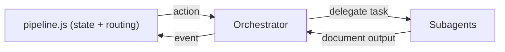
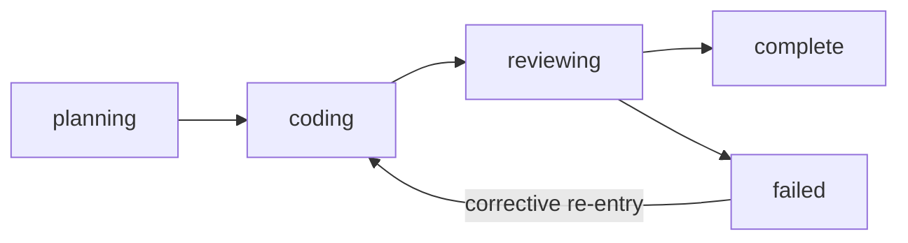
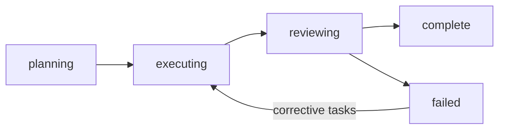
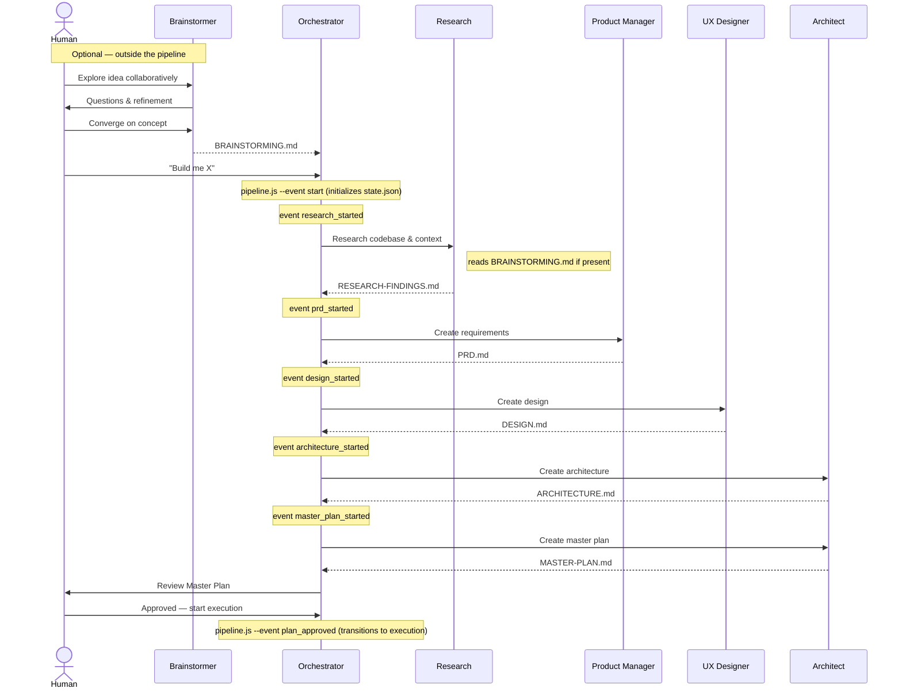

# Pipeline

The orchestration pipeline takes a project from idea through planning, execution, and review. The Orchestrator coordinates each step — spawning specialized agents, enforcing human gates, and managing state transitions automatically. A pipeline script handles all state mutations, ensuring every run is deterministic and reproducible.



## Pipeline Tiers

The pipeline progresses through four major tiers:


A project can also be `halted` from any tier when a critical error occurs or a human gate is not satisfied.

## Status vs. Stage

The system tracks work progress at two levels of granularity on every task and phase:

| Field | Purpose | Values |
|-------|---------|--------|
| `status` | Coarse pipeline gate — controls tier advancement and human gates | `not_started`, `in_progress`, `complete`, `failed`, `halted` |
| `stage` | Precise work focus within a status — controls what the next agent action is | See lifecycle diagrams below |

**Why two fields?** `status` alone cannot distinguish "started but still coding" from "started but waiting for review". The `stage` field fills this gap: the resolver matches on `stage` to determine the correct next action rather than inferring it from the presence or absence of doc paths.

### Task Stage Lifecycle



| Stage | Meaning |
|-------|---------|
| `planning` | Tactical Planner is creating (or re-creating) the task handoff |
| `coding` | Coder is executing the task |
| `reviewing` | Reviewer is evaluating the code |
| `complete` | Code review approved — terminal |
| `failed` | Review verdict was `changes_requested` — Tactical Planner creates a corrective task handoff to re-enter at `coding` if retries remain; terminal if retries exhausted |

### Phase Stage Lifecycle



| Stage | Meaning |
|-------|---------|
| `planning` | Tactical Planner is creating the phase plan. Phase starts as `not_started / planning`; the `phase_planning_started` event transitions it to `in_progress / planning` before the Tactical Planner is spawned (fresh phases only — corrective re-planning skips this step). |
| `executing` | Tasks are being executed |
| `reviewing` | Phase report/review is in progress |
| `complete` | Phase review approved — terminal |
| `failed` | Phase review verdict was `changes_requested` — Tactical Planner creates a corrective Phase Plan re-entering execution; or phase review was `rejected` — pipeline halts |

## Planning Pipeline

The planning phase produces all the documents needed before any code is written.



### Planning Steps

Each planning step runs sequentially in fixed order:

| Step | Agent | Output |
|------|-------|--------|
| 1. Research | Research | `RESEARCH-FINDINGS.md` |
| 2. Requirements | Product Manager | `PRD.md` |
| 3. Design | UX Designer | `DESIGN.md` |
| 4. Architecture | Architect | `ARCHITECTURE.md` |
| 5. Master Plan | Architect | `MASTER-PLAN.md` |

Each planning step receives all outputs from preceding steps: the Product Manager reads the Research Findings; the UX Designer reads the PRD; the Architect reads the PRD and Design; and the Master Plan synthesizes all four. This chain ensures every document is grounded in the decisions before it.

After all steps complete, the system transitions to a **human gate** — the Master Plan must be reviewed and approved before execution begins.

## Execution Pipeline

Execution is organized into **phases**, each containing multiple **tasks**. Phases execute sequentially; tasks within a phase execute sequentially.


### Task Lifecycle

Each task progresses through a deterministic lifecycle:

1. **Handoff** — Tactical Planner creates a self-contained Task Handoff document; task `stage` advances to `coding`
2. **Execution** — Coder implements the task (code + tests only); the `task_completed` event sets `stage → reviewing` while `status` **remains `in_progress`** — the task is not complete yet, it is waiting for review
3. **Review** — Reviewer evaluates the code in two passes: conformance against the planning documents (PRD, architecture, design), then an independent assessment of code quality (correctness, security, test coverage, and general best practices)
4. **Resolution** — Pipeline script processes the `code_review_completed` event: if approved, `status → complete` and `stage → complete`; if `changes_requested` with retries remaining, `status → failed` and `stage → failed` (retries incremented) — the Tactical Planner then creates a corrective task handoff, which resets `status → in_progress` and `stage → coding`; if `changes_requested` with no retries remaining, `status → halted` and `stage → failed`

> **Note:** `complete` is truly terminal for tasks. A task that reaches `status = complete` cannot be retried or failed. The retry path is corrective re-entry: on `changes_requested`, the task transitions to `status = failed`, `stage = failed` (retries incremented); the Tactical Planner then creates a corrective task handoff which resets `status → in_progress`, `stage → coding`, and clears the stale review doc.

### Phase Lifecycle

When a fresh (non-corrective) phase begins, the Orchestrator signals `phase_planning_started` with empty context. This transitions the phase from `not_started / planning` to `in_progress / planning`. The Orchestrator then spawns the Tactical Planner to create the phase plan; upon completion, `phase_plan_created` transitions the phase to `in_progress / executing`. For corrective re-planning (`is_correction: true`), `phase_planning_started` is skipped — the phase is already `in_progress / failed` and proceeds directly to the Tactical Planner.

After all tasks in a phase are complete:

1. **Phase Report** — Tactical Planner aggregates task results and assesses exit criteria; phase `stage` advances to `reviewing`
2. **Phase Review** — Reviewer performs cross-task integration review
3. **Resolution** — Pipeline script processes the `phase_review_completed` event: applies state mutation, validates, resolves next action
4. **Advance or Correct** — if approved, the pipeline advances to the next phase via `create_phase_plan`; if `changes_requested` with corrective tasks issued, the phase stage transitions to `failed` (`reviewing → failed`), the resolver routes to `create_phase_plan` with corrective context (`is_correction: true`, `previous_review` path), and the Tactical Planner produces a new Phase Plan leading with corrective tasks — `handlePhasePlanCreated` then transitions the phase back to `executing` (`failed → executing`) for a corrective re-entry cycle; if `rejected`, `display_halted` (halt)

## Human Gates

Human gates are enforced checkpoints that require explicit approval before the pipeline proceeds.

| Gate | When | Configurable? |
|------|------|---------------|
| **After planning** | Master Plan is complete | No — always enforced |
| **During execution** | Varies by mode | Yes — see below |
| **After final review** | All phases complete, final review done | No — always enforced |

### Execution Gate Modes

Controlled by `human_gates.execution_mode` in `orchestration.yml`:

| Mode | Behavior |
|------|----------|
| `ask` | Prompt the human at the start of execution for their preferred level of oversight |
| `phase` | Gate before each phase begins |
| `task` | Gate before each task begins |
| `autonomous` | No gates during execution — run all phases and tasks automatically |

## Error Handling

Errors are classified by severity with deterministic responses:

| Severity | Examples | Pipeline Response |
|----------|----------|------------------|
| **Critical** | Build failure, security vulnerability, architectural violation, data loss risk | Pipeline halts immediately. Human intervention required. Recorded in `errors.active_blockers`. |
| **Minor** | Test failure, lint error, review suggestion, missing coverage, style violation | Auto-retry via corrective task. Retry count incremented and checked against `limits.max_retries_per_task`. |

### Retry Budget

Each task has a retry budget defined by `limits.max_retries_per_task` (default: 2). When a task receives a `changes_requested` review verdict: if retries remain (`task.retries < config.limits.max_retries_per_task`), a corrective task handoff is issued (re-entering at `stage = coding`); if retries are exhausted, the pipeline halts.

The pipeline script encodes this logic in a deterministic decision table — the same review verdict with the same retry state always produces the same action.

## Pipeline Routing

Pipeline routing is event-driven. The Orchestrator signals events and receives actions in response. All routing is deterministic: the same event with the same project state always produces the same result.

The Orchestrator reads the returned action and performs the corresponding operation — spawning an agent, presenting a human gate, or terminating the loop.

See [Deterministic Scripts](internals/scripts.md) for the full event vocabulary and CLI reference.

For dependency scheduling and task ordering, see [Dependency Model](internals/dependency-model.md).

## State Management

Pipeline state is tracked in `state.json` — see [Project Structure](project-structure.md) for the file layout and naming conventions.

Key rules:
- Only the pipeline script writes `state.json`
- Every state mutation is validated against invariants before being written to disk. Invalid state never reaches disk.
- Task `status` transitions follow a strict map — `complete` is **terminal** (no `complete → failed` path exists):
  ```mermaid
  flowchart LR
      not_started --> in_progress
      in_progress --> complete
      in_progress --> failed
      in_progress --> halted
      failed -->|retry path| in_progress
      complete([complete - terminal])
      halted([halted - terminal])
  ```
- Task `stage` tracks precise work focus within `in_progress` — the resolver matches on `stage` to determine the next action
- All index references (phases, tasks) are **1-based**: `current_phase = 1` means the first phase; `current_task = 1` means the first task within the current phase
- Only one task is active at a time across the entire project.

## Next Steps

- [Agents](agents.md) — The 12 specialized agents and their roles in the pipeline
- [Configuration](configuration.md) — System settings, limits, and human gate configuration
- [Scripts Reference](internals/scripts.md) — Full event vocabulary, action definitions, and CLI interface
- [Dependency Model](internals/dependency-model.md) — Dependency scheduling between tasks
- [System Architecture](internals/system-architecture.md) — Runtime architecture, services, data flows, and integration points
- [Planning Pipeline Overhaul](internals/planning-pipeline-overhaul.md) — Analysis and reform plan for the planning pipeline
- [Project Structure](project-structure.md) — File layout, naming conventions, and document types
